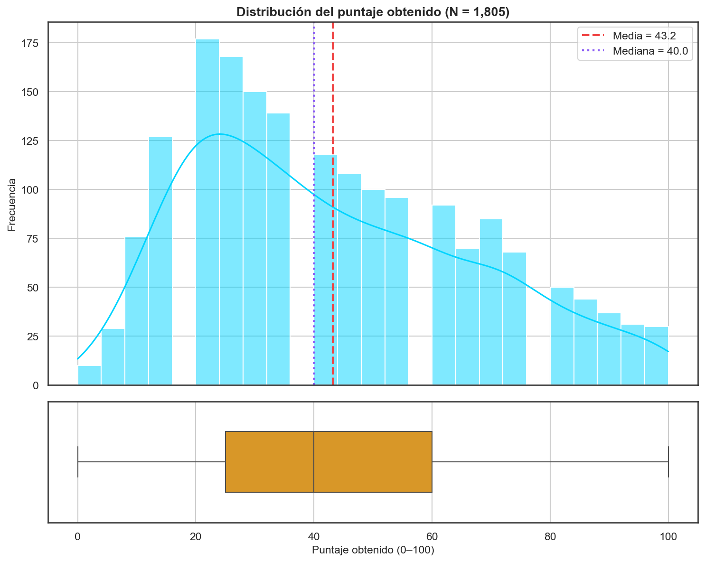
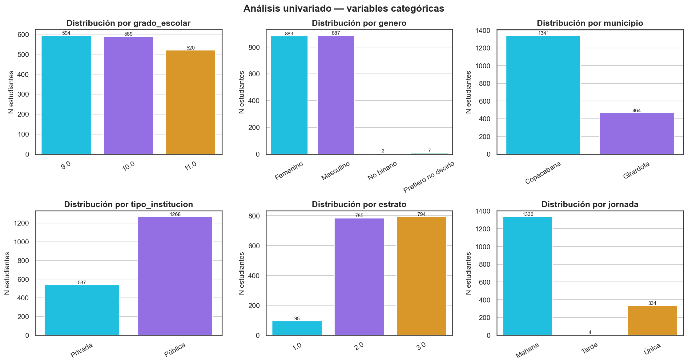
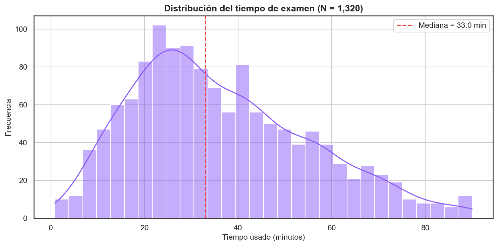
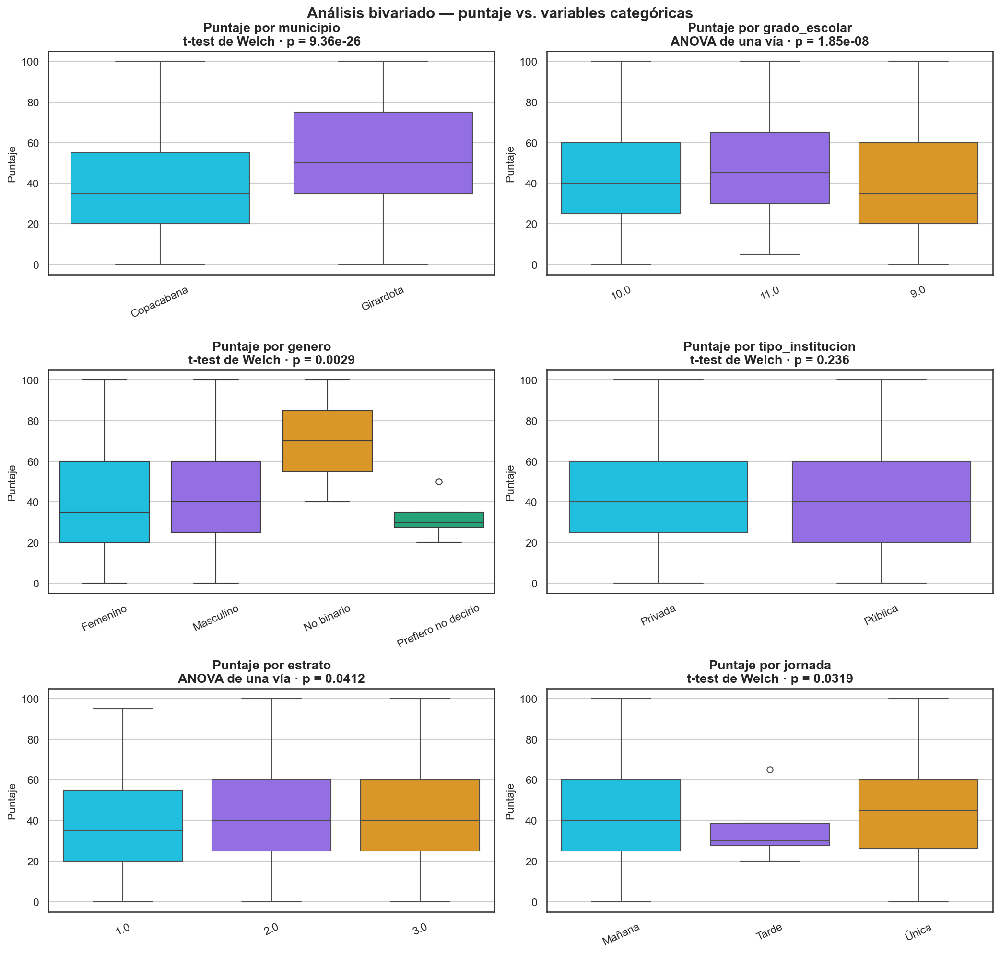
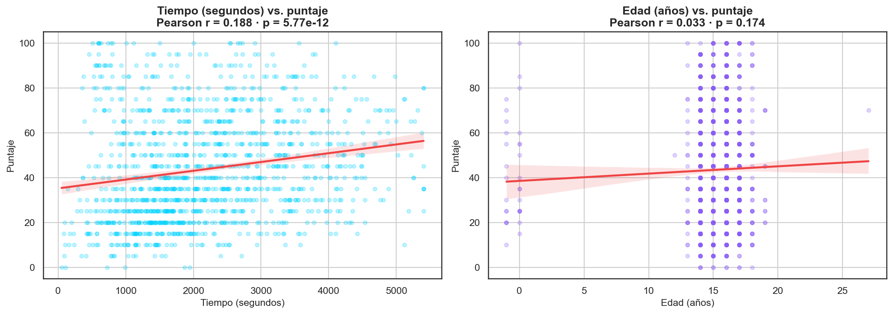
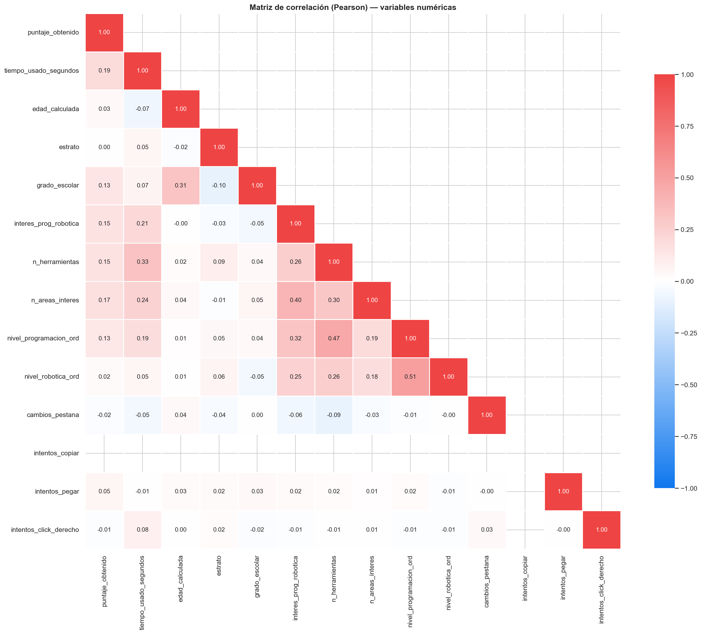
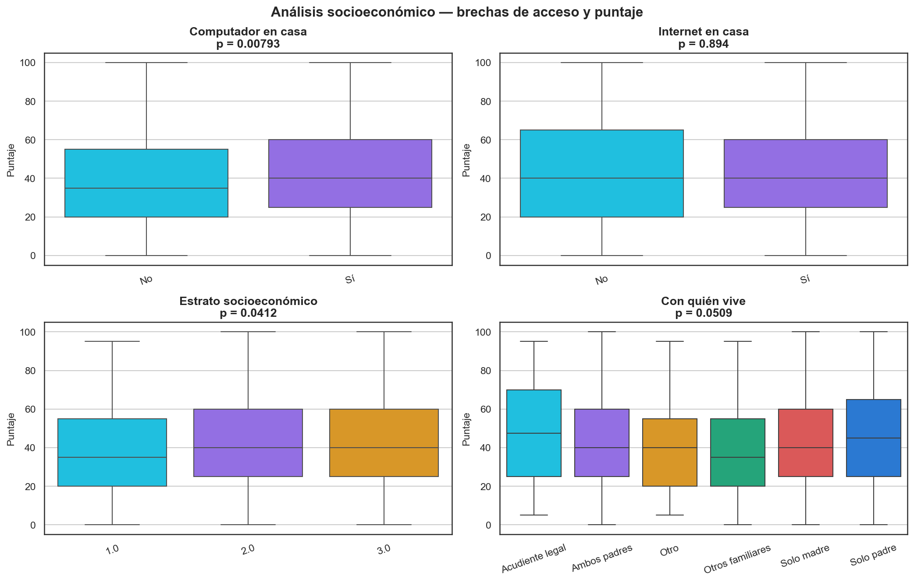
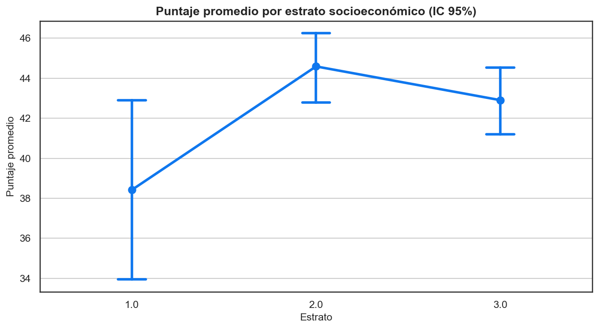
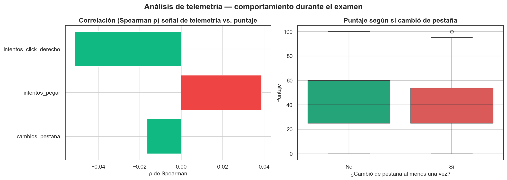
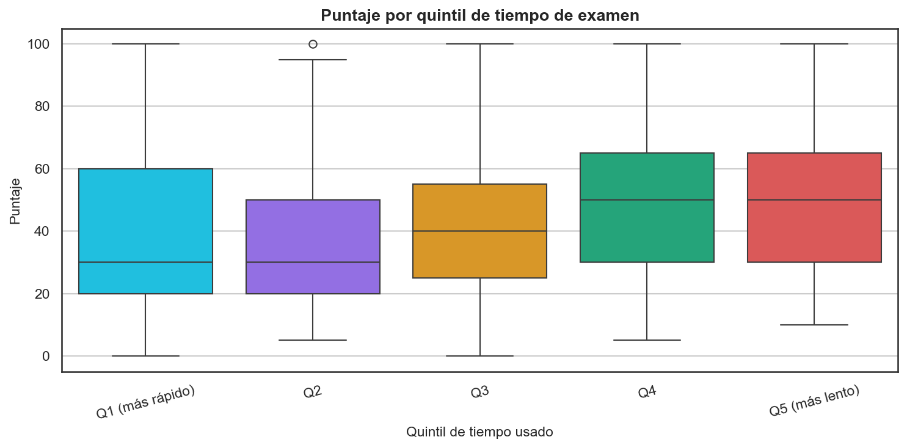

# Análisis Exploratorio — Copa STEM 2026

**Fundación SapienceLab** · Informe generado: 2026-07-06 07:50

---

## Resumen ejecutivo

La muestra analizada corresponde a **1,805 estudiantes** que
presentaron la prueba Copa STEM 2026. El puntaje promedio es de
**43.2/100** (mediana 40.0, desviación
estándar 24.1), con una distribución **asimétrica a la derecha**
(asimetría = 0.51). Las variables con diferencias
estadísticamente significativas en el puntaje fueron: `municipio`, `grado_escolar`, `genero`, `tiene_computador`.
El análisis socioeconómico y de telemetría permite priorizar hipótesis
sobre brechas de acceso y sobre comportamientos atípicos durante el
examen, insumos para las siguientes fases de modelado.

## Metodología general

El estudio sigue el flujo estándar de un Análisis Exploratorio de Datos
(EDA): (1) carga y control de calidad, (2) limpieza y derivación de
variables, (3) análisis univariado, (4) análisis bivariado con pruebas
de significancia, (5) análisis socioeconómico de brechas y (6) análisis
de telemetría de comportamiento. Todo el procesamiento es reproducible
(`random_state=42`). Las pruebas de hipótesis usan un nivel de
significancia **α = 0.05**. Para comparaciones entre **dos** grupos se
emplea el **t-test de Welch** (robusto a varianzas desiguales) con el
tamaño del efecto **Cohen's d**; para **tres o más** grupos, **ANOVA de
una vía** con **eta²**. Las correlaciones lineales usan **Pearson** y
las de telemetría (variables sesgadas/no normales) **Spearman**.

## A. Calidad de datos y limpieza

- Registros crudos: **1,809**
- Registros tras eliminar pruebas y limpiar: **1,805**
- Estudiantes que **presentaron** (con puntaje): **1,805**
- Estudiantes **sin puntaje**: **0**

**Perfil de calidad por columna** (tipo y % de nulos):

| columna | tipo | n_nulos | pct_nulos | n_unicos |
| --- | --- | --- | --- | --- |
| numero_documento | str | 0 | 0.0 | 1807 |
| nombres | str | 0 | 0.0 | 843 |
| apellidos | str | 1 | 0.06 | 1749 |
| institucion_educativa | str | 0 | 0.0 | 12 |
| grado_escolar | float64 | 102 | 5.64 | 3 |
| puntaje_obtenido | int64 | 0 | 0.0 | 21 |
| porcentaje | int64 | 0 | 0.0 | 21 |
| tiempo_usado_segundos | float64 | 485 | 26.81 | 1110 |
| cambios_pestana | int64 | 0 | 0.0 | 10 |
| intentos_copiar | int64 | 0 | 0.0 | 1 |
| intentos_pegar | int64 | 0 | 0.0 | 2 |
| intentos_click_derecho | int64 | 0 | 0.0 | 16 |
| edad_calculada | float64 | 131 | 7.24 | 11 |
| genero | str | 26 | 1.44 | 4 |
| municipio | str | 0 | 0.0 | 2 |
| tipo_institucion | str | 0 | 0.0 | 2 |
| estrato | float64 | 131 | 7.24 | 3 |
| jornada | str | 131 | 7.24 | 3 |
| con_quien_vive | str | 131 | 7.24 | 6 |
| computador_en_casa | str | 131 | 7.24 | 3 |
| internet_en_casa | str | 131 | 7.24 | 3 |
| participacion_olimpiadas | str | 131 | 7.24 | 2 |
| nivel_programacion | str | 131 | 7.24 | 4 |
| nivel_robotica | str | 131 | 7.24 | 4 |
| herramientas_conocidas | str | 131 | 7.24 | 433 |
| areas_interes | str | 131 | 7.24 | 475 |
| interes_prog_robotica | float64 | 132 | 7.3 | 5 |

## B. Análisis univariado

**Pregunta:** ¿Cómo se distribuyen el puntaje y las principales variables de la muestra?

**Estadísticas del puntaje obtenido:**

| métrica | valor |
| --- | --- |
| N | 1805.0 |
| Media | 43.16 |
| Mediana | 40.0 |
| Desv. estándar | 24.08 |
| Mínimo | 0.0 |
| Q1 | 25.0 |
| Q3 | 60.0 |
| Máximo | 100.0 |
| Asimetría | 0.512 |
| Curtosis (exceso) | -0.653 |

**Interpretación.** La asimetría (0.51) y la curtosis
(-0.65) indican cuán alejada está la distribución de la
normalidad; valores cercanos a 0 sugieren simetría/mesocurtosis. Esto
justifica el uso de pruebas robustas y correlaciones de Spearman en las
secciones siguientes.

## C. Análisis bivariado y pruebas de significancia

**Pregunta:** ¿El puntaje difiere significativamente según las características demográficas y académicas?

| Variable | Prueba | Estadístico | p-value | Cohen's d | Significativo (α=0.05) | eta² |
| --- | --- | --- | --- | --- | --- | --- |
| municipio | t-test de Welch | -10.895 | 9.36e-26 | -0.613 | Sí | nan |
| grado_escolar | ANOVA de una vía | 17.992 | 1.85e-08 | nan | Sí | 0.021 |
| genero | t-test de Welch | -2.982 | 0.0029 | -0.142 | Sí | nan |
| tipo_institucion | t-test de Welch | 1.185 | 0.236 | 0.058 | No | nan |
| estrato | ANOVA de una vía | 3.196 | 0.0412 | nan | Sí | 0.004 |
| jornada | t-test de Welch | -2.151 | 0.0319 | -0.125 | Sí | nan |

**Variables más correlacionadas con el puntaje (|Pearson r|):**

| Variable | Pearson r |
| --- | --- |
| tiempo_usado_segundos | 0.188 |
| n_areas_interes | 0.168 |
| n_herramientas | 0.154 |
| interes_prog_robotica | 0.149 |
| grado_escolar | 0.135 |
| nivel_programacion_ord | 0.126 |
| intentos_pegar | 0.051 |
| edad_calculada | 0.033 |
| nivel_robotica_ord | 0.024 |
| cambios_pestana | -0.016 |
| intentos_click_derecho | -0.008 |
| estrato | 0.002 |

**Interpretación.** Un p-value < 0.05 indica que la diferencia de
puntaje entre grupos es poco probable por azar. El tamaño del efecto
(Cohen's d / eta²) matiza la magnitud práctica: diferencias
significativas pero con efecto pequeño deben leerse con cautela.

## D. Análisis socioeconómico y de brechas

**Pregunta:** ¿Los estudiantes con menos recursos (sin computador/internet, estratos bajos) rinden menos?

| Variable | Prueba | p-value | Cohen's d | Medias por grupo | eta² |
| --- | --- | --- | --- | --- | --- |
| tiene_computador | t-test de Welch | 0.00793 | -0.153 | No: 40.7; Sí: 44.3 | nan |
| tiene_internet | t-test de Welch | 0.894 | 0.02 | No: 43.9; Sí: 43.4 | nan |
| estrato | ANOVA de una vía | 0.0412 | nan | 1.0: 38.4; 2.0: 44.6; 3.0: 42.9 | 0.004 |
| con_quien_vive | ANOVA de una vía | 0.0509 | nan | Acudiente legal: 47.2; Ambos padres: 44.1; Otro: 38.9; Otros familiares: 39.2; Solo madre: 43.3; Solo padre: 48.2 | 0.007 |

**Interpretación.** Si el puntaje crece de forma monótona con el estrato
o es mayor entre quienes tienen computador/internet, hay evidencia de
una **brecha de acceso** que la Fundación puede atender con
intervenciones focalizadas. La magnitud del efecto indica la prioridad.

## E. Análisis de telemetría (comportamiento)

**Pregunta:** ¿Las señales de comportamiento (cambios de pestaña, copiar/pegar) se asocian con el puntaje? ¿Los más rápidos rinden distinto?

| Señal | Spearman ρ | p-value | N |
| --- | --- | --- | --- |
| cambios_pestana | -0.016 | 0.486 | 1805 |
| intentos_pegar | 0.039 | 0.0993 | 1805 |
| intentos_click_derecho | -0.051 | 0.0287 | 1805 |

**Cambios de pestaña vs. puntaje:** los estudiantes que cambiaron de
pestaña al menos una vez (N=118) obtuvieron en promedio
**41.0**, frente a **43.3**
de quienes no lo hicieron (N=1687). Diferencia con
p = 0.279 (Cohen's d = -0.097).

**Interpretación.** Correlaciones positivas entre señales de
copiar/pegar/cambio de pestaña y el puntaje serían una **señal de alerta
de posible fraude** a investigar en la Fase 3 (detección de anomalías).
La relación entre tiempo y puntaje ayuda a distinguir a quienes abandonan
pronto (bajo puntaje) de quienes resuelven con eficiencia.

## Conclusiones y recomendaciones

1. **Factores asociados al rendimiento.** Los factores con diferencias
   significativas (`municipio`, `grado_escolar`, `genero`, `tiene_computador`) deben incluirse como variables
   candidatas en el modelo de predicción de puntaje (Fase 2,
   `03_prediccion_puntaje.py`).
2. **Brechas de acceso.** Priorizar el análisis dedicado de brechas
   (`02_analisis_brechas.py`) para cuantificar el efecto neto del acceso
   a tecnología controlando por otras variables.
3. **Integridad del examen.** Las señales de telemetría con correlación
   positiva justifican un modelo de detección de anomalías
   (`07_deteccion_anomalias.py`).
4. **Segmentación.** La heterogeneidad observada sugiere construir
   perfiles de estudiante mediante clustering (`06_clustering_estudiantes.py`).

## Limitaciones del estudio

- **Datos observacionales:** las asociaciones detectadas **no implican
  causalidad**; factores no medidos (calidad docente, motivación) pueden
  confundir los resultados.
- **Telemetría parcial:** solo existe para exámenes en plataforma; los
  exámenes escritos tienen estos campos vacíos, lo que puede sesgar el
  análisis de comportamiento.
- **Autoreporte:** variables socioeconómicas (estrato, acceso a
  tecnología, con quién vive) son autorreportadas y sujetas a error.
- **Comparaciones múltiples:** se realizan varias pruebas de hipótesis;
  conviene aplicar correcciones (p. ej. Bonferroni) antes de conclusiones
  definitivas.
- **Tamaños de grupo desiguales:** algunas categorías tienen pocos casos,
  reduciendo la potencia estadística (se exigió N≥15 por grupo).

## Referencias técnicas

- Tukey, J. W. (1977). *Exploratory Data Analysis*. Addison-Wesley.
- Welch, B. L. (1947). "The generalization of 'Student's' problem when
  several different population variances are involved." *Biometrika*.
- Fisher, R. A. (1925). *Statistical Methods for Research Workers*
  (ANOVA).
- Cohen, J. (1988). *Statistical Power Analysis for the Behavioral
  Sciences* (Cohen's d, eta²).
- Spearman, C. (1904). "The proof and measurement of association between
  two things." *American Journal of Psychology*.
- McKinney, W. (2010). *Data Structures for Statistical Computing in
  Python* (pandas). · Virtanen et al. (2020). *SciPy 1.0* (Nature
  Methods). · Waskom, M. (2021). *seaborn* (JOSS).

---
_Generado automáticamente por `notebooks/01_analisis_exploratorio.py` — Copa STEM 2026._
