# Análisis de Brechas — Copa STEM 2026

**Fundación SapienceLab** · Informe generado: 2026-07-06 07:50

---

## Resumen ejecutivo

Se analizaron **1,805 estudiantes** que presentaron Copa STEM 2026
para cuantificar brechas de equidad. La brecha de **género** resultó
**significativa**: los hombres promedian 44.9
frente a 41.5 de las mujeres. La brecha
**territorial** es la más marcada — **Girardota** lidera el rendimiento territorial (53.8 puntos). El acceso a **computador**
muestra una diferencia **significativa**
en el puntaje. Se identificaron **140 casos de talento
oculto** (puntaje > 70 con bajo acceso tecnológico o estrato
1-2) que constituyen el foco prioritario de intervención de la Fundación.

## Metodología

Se emplean pruebas de hipótesis con α = 0.05. Para dos grupos, **t-test
de Welch** (robusto a varianzas desiguales) con **Cohen's d**; para tres
o más, **ANOVA de una vía** con **eta²**. Se exige N ≥ 15 por grupo. El
talento oculto se define como puntaje > 70 combinado con ausencia de
computador/internet en casa o pertenencia a estrato 1-2. Procesamiento
reproducible (`random_state=42`).

## A. Brechas de género

**Pregunta:** ¿existe una diferencia significativa de puntaje entre hombres y mujeres?

**Método:** t-test de Welch (Masculino vs. Femenino) + histogramas superpuestos.

**Resultado:**

| Grupo | N | Puntaje medio |
| --- | --- | --- |
| Femenino | 883 | 41.48 |
| Masculino | 887 | 44.88 |

- t = 2.982 · p = 0.0029 · Cohen's d = 0.142

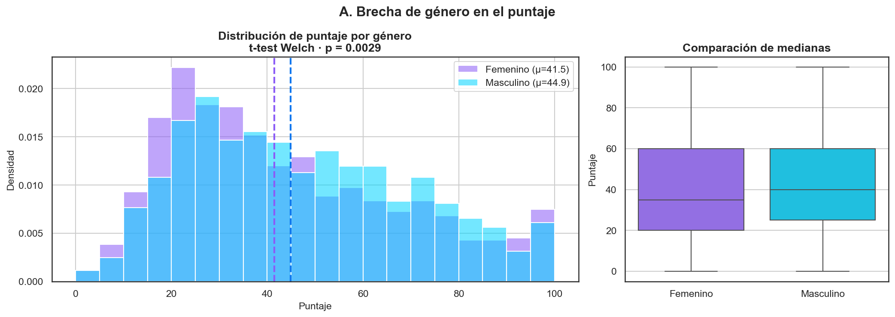

**Interpretación.** La diferencia es **significativa**. El
tamaño del efecto (Cohen's d = 0.142)
indica una magnitud pequeña;
conviene monitorearla pero no domina el resultado global.

## B. Brechas socioeconómicas

**Pregunta:** ¿el estrato y el acceso a tecnología se asocian con el puntaje?

| Variable | Prueba | p-value | eta² | Significativa | Cohen's d |
| --- | --- | --- | --- | --- | --- |
| Estrato (ANOVA) | ANOVA de una vía | 0.0412 | 0.004 | Sí | nan |
| Tiene computador | t-test de Welch | 0.00793 | nan | Sí | -0.153 |
| Tiene internet | t-test de Welch | 0.894 | nan | No | 0.02 |
| Con quién vive | ANOVA de una vía | 0.0509 | 0.007 | No | nan |

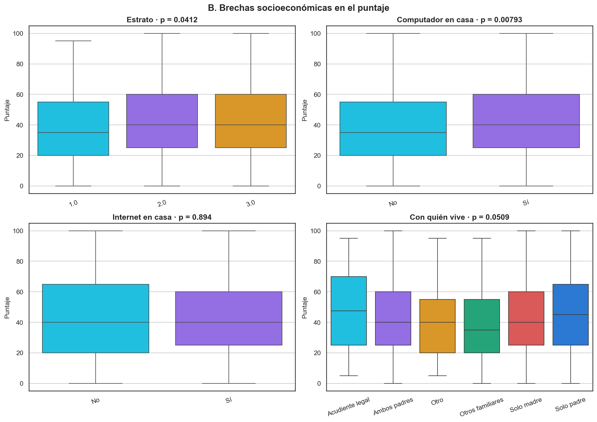

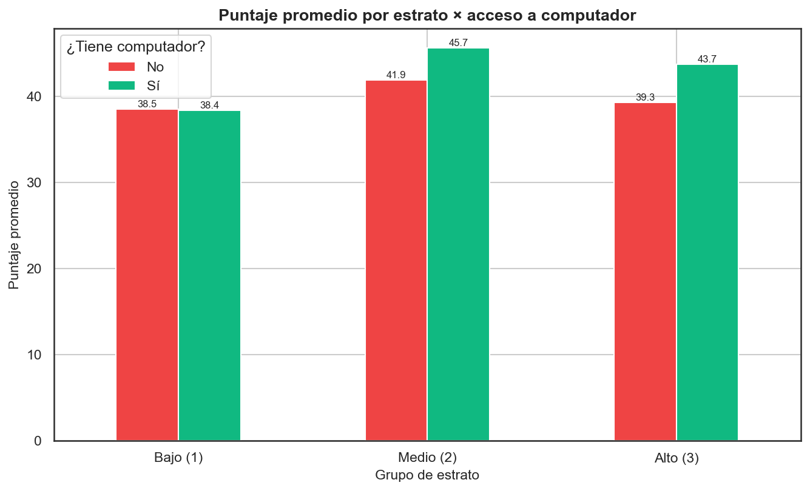

**Cruce estrato × acceso a computador:**

| Grupo estrato | ¿Computador? | Puntaje medio | N |
| --- | --- | --- | --- |
| Bajo (1) | No | 38.51 | 37 |
| Bajo (1) | Sí | 38.36 | 58 |
| Medio (2) | No | 41.91 | 225 |
| Medio (2) | Sí | 45.66 | 560 |
| Alto (3) | No | 39.32 | 147 |
| Alto (3) | Sí | 43.72 | 647 |

**Interpretación.** El cruce estrato × acceso permite distinguir el
efecto del **recurso** (computador) del efecto del **entorno** (estrato).
Si dentro de cada estrato quienes tienen computador rinden más, la
política debe priorizar dotación tecnológica; si la brecha persiste por
estrato aun con computador, el problema es más estructural.

## C. Brechas territoriales

**Pregunta:** ¿difiere el rendimiento entre municipios, entre instituciones públicas/privadas y entre colegios?

| Comparación | Prueba | p-value | Medias | Significativa |
| --- | --- | --- | --- | --- |
| Municipio | t-test de Welch | 9.36e-26 | Copacabana: 39.5; Girardota: 53.8 | Sí |
| Tipo de institución | t-test de Welch | 0.236 | Privada: 44.2; Pública: 42.7 | No |

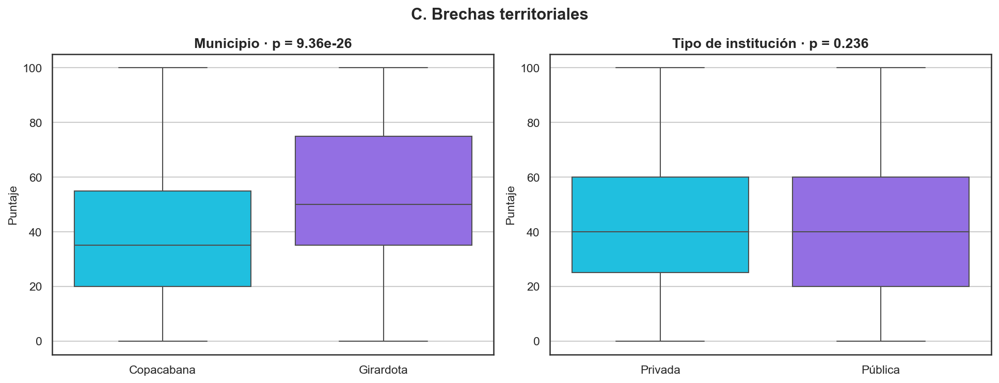

**Ranking de instituciones (N ≥ 10):**

| Institución | Puntaje medio | N |
| --- | --- | --- |
| Colegio Neosistemas | 64.87 | 78 |
| I.E. Emiliano García | 58.15 | 216 |
| I.E. Gabriela Mistral | 50.0 | 43 |
| Instituto Parroquial Nuestra Señora de la Presentación | 46.99 | 88 |
| I.E. Atanasio Girardot | 46.76 | 17 |
| Colegio San Rafael | 44.33 | 67 |
| I.E. José Miguel de Restrepo y Puerta | 43.03 | 449 |
| Colegio Cooperativo Juan del Corral | 39.74 | 115 |
| I.E. San Luis Gonzaga | 37.84 | 283 |
| Colegio La Asunción | 36.94 | 124 |
| Colegio Nuestra Señora del Rosario | 36.85 | 65 |
| I. E. Presbítero Bernardo Montoya Giraldo | 33.33 | 260 |

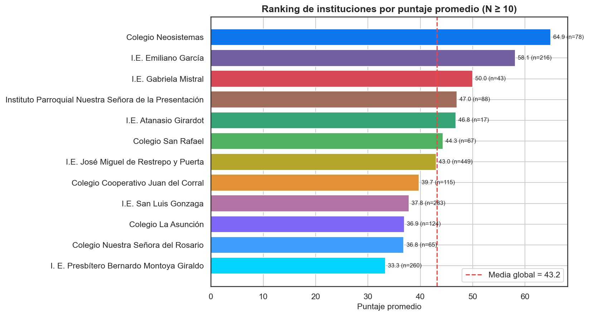

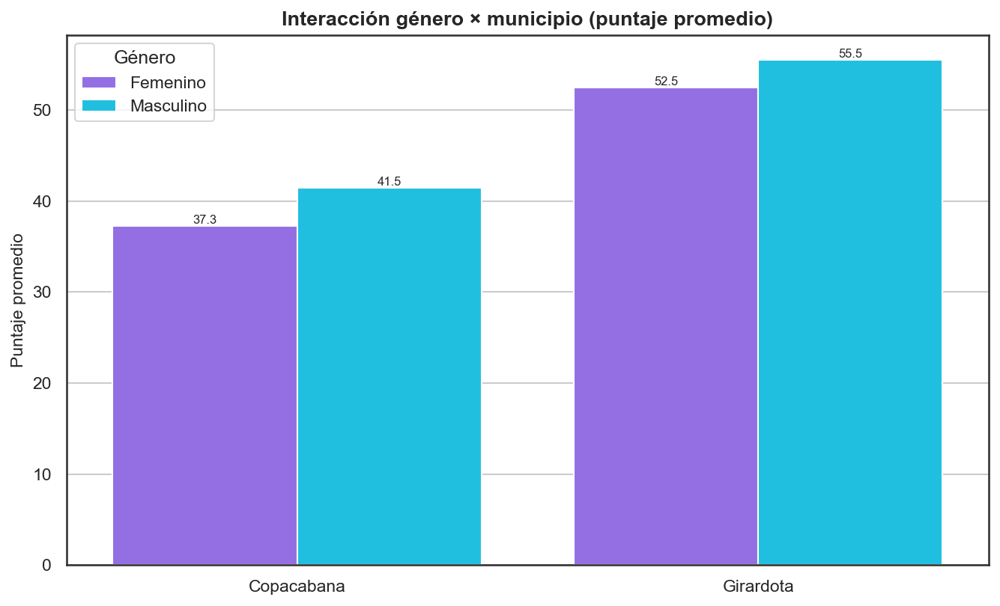

**Brecha de género (Masculino − Femenino) por municipio:**

| Municipio | Brecha (pts) | p-value |
| --- | --- | --- |
| Copacabana | 4.15 | 0.000877 |
| Girardota | 3.04 | 0.187 |

**Interpretación.** La brecha territorial es la señal más fuerte del
estudio: sugiere diferencias sistémicas (calidad de preparación, recursos
institucionales) entre municipios y colegios. El ranking permite focalizar
acompañamiento en las instituciones de menor promedio.

## D. Brechas por grado escolar

**Pregunta:** ¿el rendimiento mejora o empeora de 9° a 11°?

| Grado | Media | Mediana | Desv. | N |
| --- | --- | --- | --- | --- |
| 9.0 | 40.72 | 35.0 | 24.13 | 594 |
| 10.0 | 42.18 | 40.0 | 23.08 | 589 |
| 11.0 | 48.84 | 45.0 | 24.19 | 520 |

- ANOVA de una vía · p = 1.85e-08 · eta² = 0.021

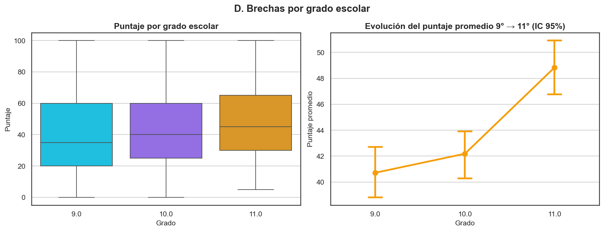

**Interpretación.** La trayectoria 9°→10°→11° indica si el sistema
agrega valor con el avance escolar. Un promedio plano o decreciente en
grados superiores sería una alerta sobre la preparación en matemáticas
y lógica en la media vocacional.

## E. Detección de talento oculto

**Pregunta:** ¿qué estudiantes de alto desempeño (puntaje > 70) enfrentan barreras de acceso y merecen intervención prioritaria?

**Resultado:** de **260** estudiantes con puntaje >
70, **140** cumplen al menos un criterio de
vulnerabilidad (sin computador/internet en casa, o estrato 1-2). La lista
completa se exportó a `outputs/talento_oculto.csv`.

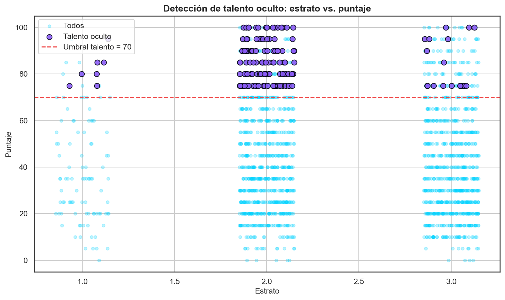

**Top talento oculto (máx. 20; listado completo en el CSV):**

| numero_documento | nombres | apellidos | institucion_educativa | municipio | grado_escolar | estrato | tiene_computador | tiene_internet | puntaje_obtenido | motivo |
| --- | --- | --- | --- | --- | --- | --- | --- | --- | --- | --- |
| 1035861361 | Valery | Zapata sierra | I.E. Emiliano García | Girardota | 10.0 | 2.0 | Sí | Sí | 100 | Estrato 1-2 |
| 1036519373 | luciana | Castro zapata | I.E. Emiliano García | Girardota | 11.0 | 2.0 | Sí | Sí | 100 | Estrato 1-2 |
| 1035856749 | Juan jose | Rua zapata | I.E. Emiliano García | Girardota | 11.0 | 2.0 | No | Sí | 100 | Bajo acceso + estrato bajo |
| 1035857984 | esteban | Suárez Orlas | I.E. Emiliano García | Girardota | 11.0 | 3.0 | No | Sí | 100 | Sin computador/internet |
| 1035424451 | Emanuel | Ramírez Arroyave | I.E. Emiliano García | Girardota | 11.0 | 2.0 | No | Sí | 100 | Bajo acceso + estrato bajo |
| 1022006220 | Jose Miguel | Saldarriaga Sepulveda | I.E. Emiliano García | Girardota | 10.0 | 2.0 | Sí | Sí | 100 | Estrato 1-2 |
| 1057096101 | Liedson | Cruz cortinez | I.E. Emiliano García | Girardota | 10.0 | 2.0 | No | Sí | 100 | Bajo acceso + estrato bajo |
| 1036519458 | María Antonia | Ramírez Castrillón | I.E. Emiliano García | Girardota | 11.0 | 2.0 | No | Sí | 100 | Bajo acceso + estrato bajo |
| 1014669455 | María José | González González | I.E. Emiliano García | Girardota | 11.0 | 2.0 | Sí | Sí | 100 | Estrato 1-2 |
| 1025894876 | Juan José | Vallejo Hoyos | I.E. Emiliano García | Girardota | 9.0 | 3.0 | No | Sí | 100 | Sin computador/internet |
| 1013344970 | Joshua | Bermúdez Seguro | Colegio San Rafael | Copacabana | 11.0 | 2.0 | Sí | Sí | 100 | Estrato 1-2 |
| 1029989055 | Johan Esteban | Galindo Meneses | Colegio Neosistemas | Girardota | 11.0 | 2.0 | Sí | Sí | 100 | Estrato 1-2 |
| 1032015955 | Dylan Alexander | Restrepo Colorado | I.E. San Luis Gonzaga | Copacabana | 9.0 | 3.0 | No | Sí | 100 | Sin computador/internet |
| 1020307682 | Juan Jose | Ruiz Sanchez | Instituto Parroquial Nuestra Señora de la Presentación | Girardota | 10.0 | 2.0 | Sí | Sí | 100 | Estrato 1-2 |
| 1023640191 | Jhonatan | Arroyave Muñoz | I.E. Gabriela Mistral | Copacabana | 9.0 | 2.0 | No | Sí | 100 | Bajo acceso + estrato bajo |
| 1044151099 | Maria Angélica | Espinosa Cano | I.E. Emiliano García | Girardota | 11.0 | 2.0 | Sí | Sí | 100 | Estrato 1-2 |
| 1022150422 | Maria Paulina | Serna Betancur | I.E. Gabriela Mistral | Copacabana | 11.0 | 2.0 | No | No | 100 | Bajo acceso + estrato bajo |
| 1035422691 | Emanuel | Correa Agudelo | I.E. Gabriela Mistral | Copacabana | 11.0 | 2.0 | No | Sí | 100 | Bajo acceso + estrato bajo |
| 1037975338 | Marlen Sofía | López Arias | I.E. Emiliano García | Girardota | 9.0 | 2.0 | Sí | Sí | 95 | Estrato 1-2 |
| 1042154218 | Alejandro | Vergara Tilano | I.E. José Miguel de Restrepo y Puerta | Copacabana | 10.0 | 2.0 | No | Sí | 95 | Bajo acceso + estrato bajo |

**Interpretación.** Estos estudiantes demuestran alto potencial STEM
**a pesar** de recursos limitados: son el retorno social más alto de una
beca o acompañamiento. Se recomienda contacto directo con sus
instituciones.

## F. Análisis cruzado profundo

**Pregunta:** ¿cómo interactúan los factores entre sí y qué papel juega la experiencia previa (olimpiadas, programación)?

**Método:** tablas cruzadas de puntaje promedio (heatmaps), t-test para experiencia previa, ANOVA para nivel de programación y ANOVA de dos vías para la interacción género × tipo de institución.

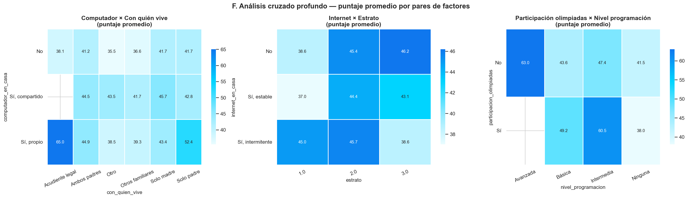

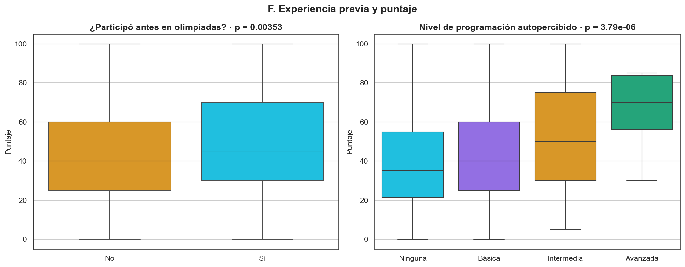

| Análisis | p-value | Efecto | Medias |
| --- | --- | --- | --- |
| Participó en olimpiadas (t-test) | 0.00353 | d=-0.236 | No:42.8; Sí:48.4 |
| Nivel de programación (ANOVA) | 3.79e-06 | eta²=0.015 | Básica:44.4; Intermedia:51.3; Ninguna:41.3 |

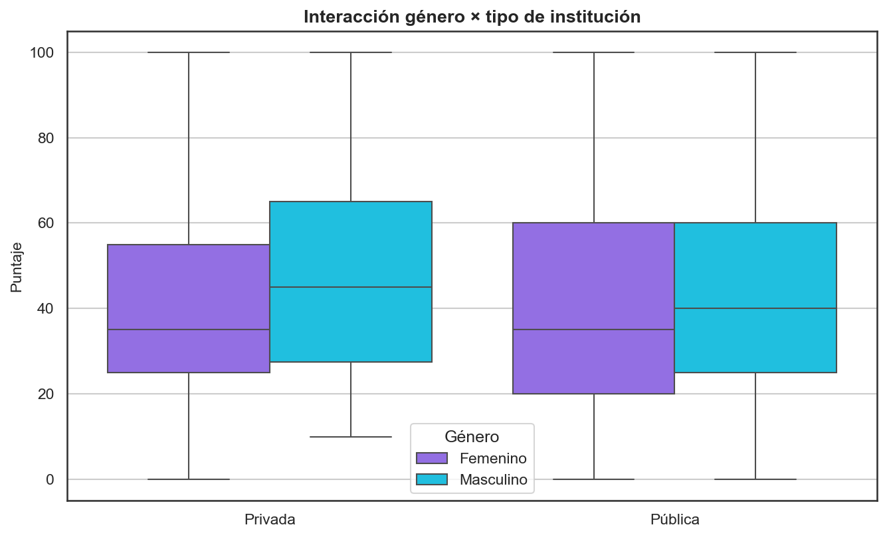

**ANOVA de dos vías (género × tipo de institución):**

| Término | sum_sq | df | F | PR(>F) |
| --- | --- | --- | --- | --- |
| C(genero) | 5027.9334 | 1.0 | 8.7519 | 0.0031 |
| C(tipo_institucion) | 724.985 | 1.0 | 1.262 | 0.2614 |
| C(genero):C(tipo_institucion) | 152.8678 | 1.0 | 0.2661 | 0.606 |
| Residual | 1014554.8251 | 1766.0 | nan | nan |

**Interpretación.** Los heatmaps revelan combinaciones de factores con
rendimiento especialmente alto o bajo (útil para focalizar). Si la
experiencia previa (olimpiadas, programación) se asocia a mayor puntaje,
conviene incorporarla como variable en los modelos predictivos. La
interacción género × institución indica si la brecha de género se
concentra en cierto tipo de colegio.

## G. Análisis por institución (profundo)

**Pregunta:** más allá del promedio, ¿qué colegios concentran mayor dispersión (talento no aprovechado) y cómo se comparan ajustando por estrato?

**Estadísticas por institución (N ≥ 10):**

| Institución | N | Media | Mediana | Desv. | Mín | Máx | % aprob. (≥60) |
| --- | --- | --- | --- | --- | --- | --- | --- |
| Colegio Neosistemas | 78 | 64.87 | 70.0 | 20.86 | 20 | 100 | 61.54 |
| I.E. Emiliano García | 216 | 58.15 | 60.0 | 25.9 | 0 | 100 | 51.39 |
| I.E. Gabriela Mistral | 43 | 50.0 | 50.0 | 24.83 | 10 | 100 | 37.21 |
| Instituto Parroquial Nuestra Señora de la Presentación | 88 | 46.99 | 45.0 | 21.11 | 10 | 100 | 29.55 |
| I.E. Atanasio Girardot | 17 | 46.76 | 50.0 | 27.33 | 5 | 95 | 29.41 |
| Colegio San Rafael | 67 | 44.33 | 40.0 | 24.45 | 5 | 100 | 31.34 |
| I.E. José Miguel de Restrepo y Puerta | 449 | 43.03 | 40.0 | 24.79 | 0 | 100 | 30.73 |
| Colegio Cooperativo Juan del Corral | 115 | 39.74 | 35.0 | 20.22 | 0 | 90 | 22.61 |
| I.E. San Luis Gonzaga | 283 | 37.84 | 35.0 | 23.03 | 0 | 100 | 19.79 |
| Colegio La Asunción | 124 | 36.94 | 30.0 | 18.57 | 10 | 85 | 17.74 |
| Colegio Nuestra Señora del Rosario | 65 | 36.85 | 35.0 | 17.67 | 5 | 85 | 10.77 |
| I. E. Presbítero Bernardo Montoya Giraldo | 260 | 33.33 | 30.0 | 18.42 | 0 | 95 | 11.92 |

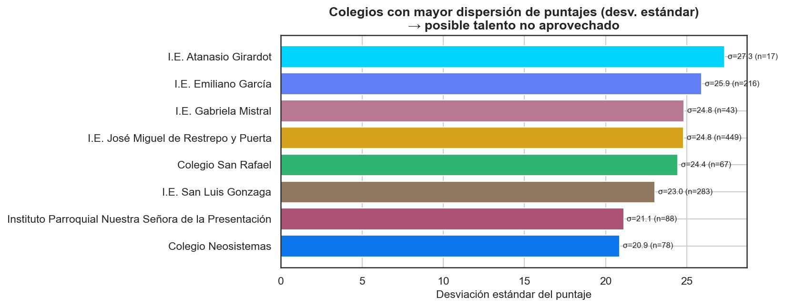

**ANCOVA simplificado** (colegios con >50 estudiantes, N=1631,
10 colegios): al modelar `puntaje ~ institución +
estrato`, la **institución** sigue siendo significativa
(p = 8.46e-47) aun controlando
por estrato (efecto del estrato: p = 0.739). Esto sugiere
que las diferencias entre colegios **no** se explican solo por su
composición socioeconómica.

**Interpretación.** Los colegios con alta desviación estándar tienen
estudiantes muy por encima y muy por debajo de su media: ahí puede haber
**talento no identificado** que se beneficiaría de acompañamiento. El
ANCOVA ayuda a separar el "efecto colegio" del "efecto estrato".

## H. Perfil del estudiante exitoso

**Pregunta:** ¿qué rasgos comparten los estudiantes de mayor desempeño frente a los de menor desempeño?

**Método:** comparación del **top 10%** (≥ 80 pts,
N=192) vs. **bottom 10%** (≤ 15 pts,
N=242) en rasgos escalados 0–1, visualizada en un
gráfico radar.

| Rasgo | Top 10% (0-1) | Bottom 10% (0-1) |
| --- | --- | --- |
| Computador en casa | 0.79 | 0.706 |
| Internet en casa | 0.966 | 0.953 |
| Participó olimpiadas | 0.17 | 0.103 |
| Nivel programación | 0.241 | 0.156 |
| Nivel robótica | 0.093 | 0.089 |
| Interés prog/robótica | 0.531 | 0.403 |
| Estrato | 0.724 | 0.72 |

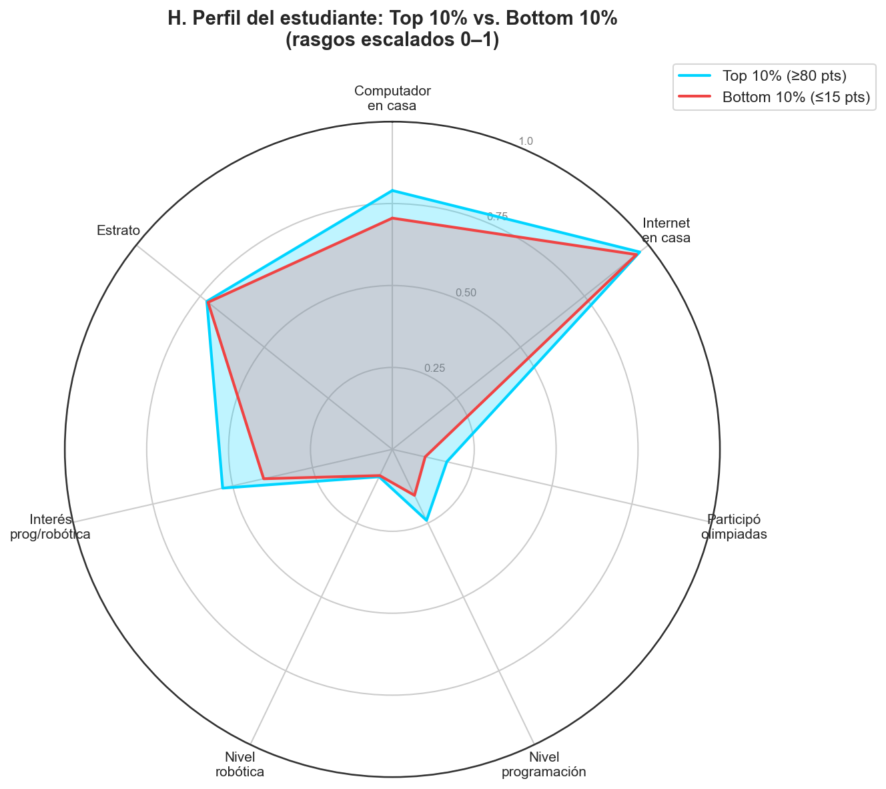

**Rasgo mayoritario de la élite (puntaje ≥ 80, N=192):**

| Característica | Valor más frecuente |
| --- | --- |
| genero | Masculino (51%) |
| municipio | Girardota (51%) |
| tipo_institucion | Pública (73%) |
| tiene_computador | Sí (79%) |
| tiene_internet | Sí (97%) |
| participo_olimpiadas | No (83%) |
| grupo_estrato | Medio (2) (49%) |

**Interpretación.** Los rasgos donde el radar del top se separa más del
bottom son los **predictores prácticos** de éxito: orientan tanto la
detección temprana de potencial como el diseño de las intervenciones
(p. ej. si la experiencia en programación distingue claramente a los
grupos, conviene ampliar la exposición temprana a la programación).

## Conclusiones y recomendaciones de política

1. **Priorizar el cierre de la brecha territorial**, la más marcada del
   estudio, con acompañamiento diferenciado a los municipios e
   instituciones de menor promedio (ver ranking).
2. **Programa de dotación tecnológica** focalizado: el acceso a computador
   mostró asociación con el puntaje; conviene atender a estudiantes sin
   computador, especialmente en estratos bajos.
3. **Becas de talento oculto:** contactar a los 140
   estudiantes identificados para tutoría, mentoría y rutas STEM.
4. **Monitoreo de equidad de género** por municipio, dado que la brecha
   puede concentrarse en territorios específicos.
5. **Refuerzo por grado:** ajustar la preparación según la trayectoria
   9°→11° observada.
6. Alimentar estos hallazgos a la Fase 2 (modelos predictivos,
   `03_prediccion_puntaje.py` y `05_talento_oculto.py`).

## Limitaciones del estudio

- **Datos observacionales:** las brechas descritas son asociaciones, no
  relaciones causales; pueden existir variables de confusión no medidas.
- **Inscripciones de emergencia:** ~7% de los registros no tienen datos
  socioeconómicos completos y quedan fuera de los análisis que requieren
  esas variables, lo que puede introducir sesgo de selección.
- **Autoreporte:** estrato, acceso a tecnología y con quién vive son
  autorreportados.
- **Comparaciones múltiples:** conviene aplicar correcciones (Bonferroni /
  FDR) antes de decisiones definitivas.
- **Umbral de talento arbitrario:** el corte en 70 puntos es una decisión
  de política revisable.

## Referencias técnicas

- Welch, B. L. (1947). *Biometrika* (t-test de varianzas desiguales).
- Fisher, R. A. (1925). *Statistical Methods for Research Workers* (ANOVA).
- Cohen, J. (1988). *Statistical Power Analysis for the Behavioral
  Sciences* (Cohen's d, eta²).
- OECD (2018). *PISA — Equity in Education* (marco de brechas educativas).
- McKinney, W. (2010). *pandas*. · Virtanen et al. (2020). *SciPy 1.0*.
  · Waskom, M. (2021). *seaborn*.

---
_Generado por `notebooks/02_analisis_brechas.py` — Copa STEM 2026._
