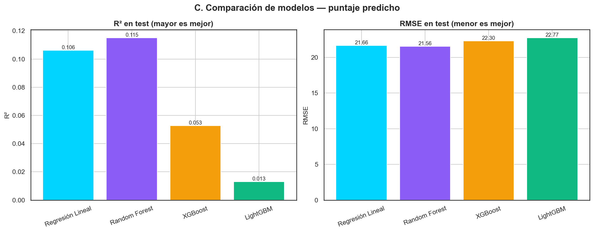
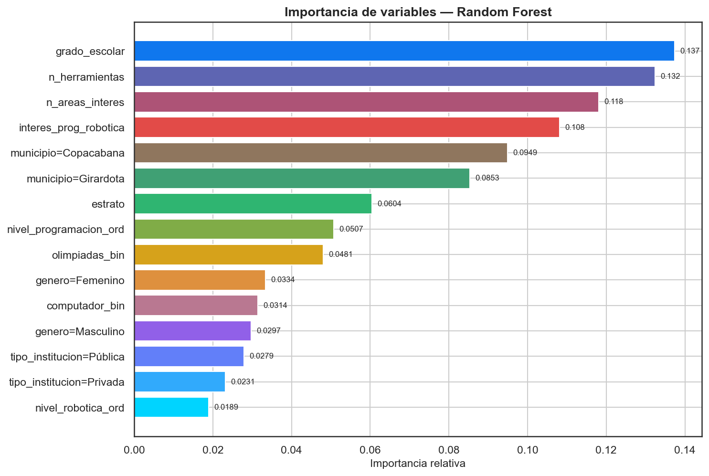
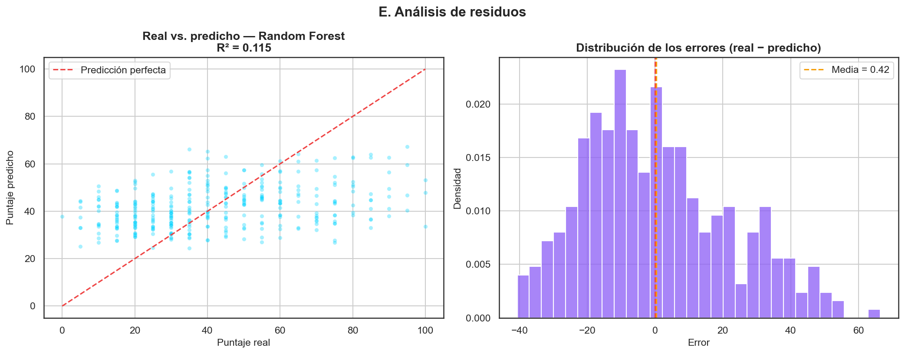
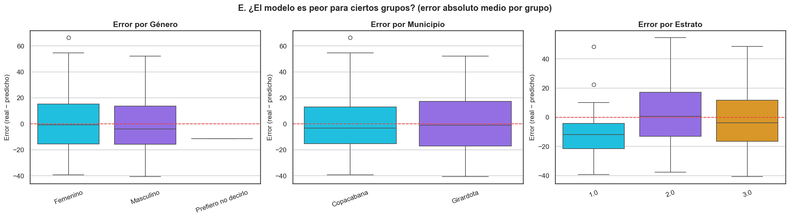
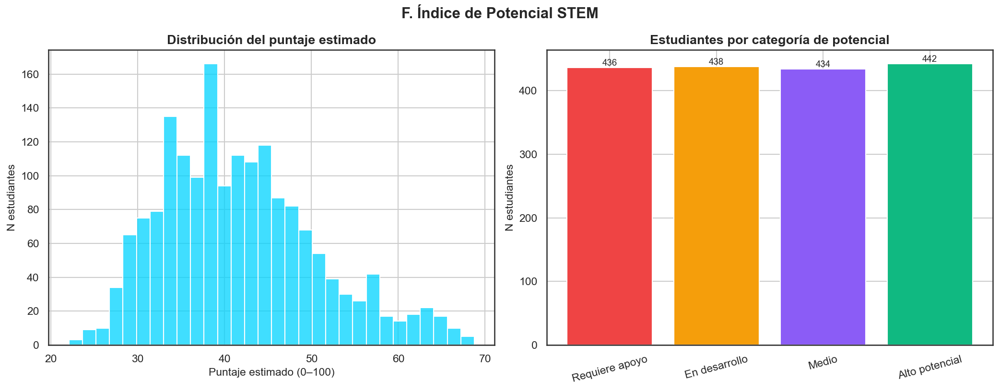

# Modelo Predictivo del Puntaje — Copa STEM 2026

**Fundación SapienceLab** · Fase 2 · Informe generado: 2026-07-06 07:51

---

## Resumen ejecutivo

Se entrenaron **4 modelos** de regresión para predecir el
`puntaje_obtenido` (0–100) a partir de 18 variables
demográficas, socioeconómicas y de experiencia previa, sobre
**1,750 estudiantes** (split 80/20 estratificado por
grado). El mejor modelo fue **Random Forest** (R² test = 0.115,
RMSE = 21.56, MAE = 17.44). A partir de él se
construyó un **Índice de Potencial STEM** (0–100) para cada estudiante,
exportado a `models/scores_potencial_stem.csv` para su carga en Supabase.
La réplica pura del modelo (`models/predictor.py`) coincide con el modelo
real dentro de un margen de **3.6e-14** puntos.

## Metodología

- **Features:** grado, género (one-hot), municipio (one-hot), tipo de
  institución (one-hot), estrato, computador e internet en casa (binarias),
  participación previa en olimpiadas (binaria), nivel de programación y de
  robótica (ordinales 0–3), interés en prog/robótica, nº de herramientas y
  nº de áreas de interés (conteos).
- **Imputación:** mediana (numéricos/ordinales) o moda (binarias/categóricas),
  calculada **solo con el train** para evitar fuga de información.
- **Validación:** 5-fold CV sobre el train + evaluación final en el test 20%.
- **Métricas:** R², RMSE y MAE. Reproducible con `random_state=42`.

## Comparación de modelos

| Modelo | R² (CV) | RMSE (CV) | MAE (CV) | R² (test) | RMSE (test) | MAE (test) |
| --- | --- | --- | --- | --- | --- | --- |
| Regresión Lineal | 0.083 ± 0.027 | 22.08 ± 1.15 | 18.21 ± 0.79 | 0.106 | 21.66 | 17.53 |
| Random Forest ⭐ | 0.064 ± 0.024 | 22.31 ± 1.20 | 18.36 ± 0.78 | 0.115 | 21.56 | 17.44 |
| XGBoost | -0.033 ± 0.044 | 23.42 ± 1.22 | 18.98 ± 0.86 | 0.053 | 22.30 | 17.82 |
| LightGBM | -0.124 ± 0.058 | 24.44 ± 1.22 | 19.75 ± 0.88 | 0.013 | 22.77 | 18.15 |





**Modelo seleccionado: Random Forest** (mayor R² en test, desempate por RMSE).

## Importancia de variables (mejor modelo)

| Variable | Importancia |
| --- | --- |
| grado_escolar | 0.1374 |
| n_herramientas | 0.1324 |
| n_areas_interes | 0.1181 |
| interes_prog_robotica | 0.1081 |
| municipio=Copacabana | 0.0949 |
| municipio=Girardota | 0.0853 |
| estrato | 0.0604 |
| nivel_programacion_ord | 0.0507 |
| olimpiadas_bin | 0.0481 |
| genero=Femenino | 0.0334 |




## Exportación para producción

- `models/mejor_modelo_puntaje.joblib` — modelo + preprocesador (uso con sklearn).
- `models/modelo_coeficientes.json` — importancias + reglas de decisión (pseudo-código).
- `models/predictor.py` — **función Python pura** `predecir_puntaje(dict)`
  que NO requiere sklearn ni librerías de ML (solo `json` + aritmética).
- `models/scores_potencial_stem.csv` — índice de potencial por estudiante.


**Reglas de decisión (ejemplo, primer árbol):**

```
# Ejemplo: árbol 1 de 300. Predicción = PROMEDIO de las hojas de todos los árboles + sesgo(-0.0000).
si [municipio=Copacabana] <= 0.5000:
  si [n_areas_interes] <= 2.5000:
    si [grado_escolar] <= 10.5000:
      si [n_areas_interes] <= 1.0000:
        => hoja: 56.6667
      si no:
        si [genero=Femenino] <= 0.5000:
          si [n_herramientas] <= 2.5000:
            => hoja: 38.8636
          si no:
            si [grado_escolar] <= 9.5000:
              => hoja: 48.0556
            si no:
              => hoja: 56.7647
        si no:
          si [estrato] <= 2.5000:
            si [n_herramientas] <= 0.5000:
              => hoja: 36.6667
            si no:
              => hoja: 50.6000
          si no:
            si [interes_prog_robotica] <= 2.5000:
              => hoja: 24.6154
            si no:
              => hoja: 37.6923
    si no:
      si [nivel_programacion_ord] <= 0.5000:
        si [computador_bin] <= 0.5000:
          => hoja: 47.0833
        si no:
          => hoja: 43.0769
      si no:
        si [estrato] <= 2.5000:
          si [genero=Masculino] <= 0.5000:
            => hoja: 65.5263
          si no:
            => hoja: 58.1250
        si no:
          => hoja: 53.6667
  si no:
    si [computador_bin] <= 0.5000:
      si [n_herramientas] <= 0.5000:
        => hoja: 59.1667
      si no:
        => hoja: 32.1429
    si no:
      si [grado_escolar] <= 10.5000:
        si [estrato] <= 2.5000:
          si [n_herramientas] <= 4.5000:
            si [tipo_institucion=Privada] <= 0.5000:
              => hoja: 64.3333
            si no:
              => hoja: 54.1667
          si no:
            => hoja: 66.3043
        si no:
          si [interes_prog_robotica] <= 3.5000:
            si [n_herramientas] <= 5.5000:
              => hoja: 42.7273
            si no:
          si no:
      si no:
si no:
```

## Análisis de residuos

El error medio (real − predicho) es **0.42** con
desviación **21.55**. Un error medio cercano a 0 indica
ausencia de sesgo sistemático.





**Error absoluto medio por grupo** (¿el modelo es peor para alguien?):

- **genero** → Femenino: 17.78; Masculino: 16.8; Prefiero no decirlo: 11.55

- **municipio** → Copacabana: 17.15; Girardota: 18.37

- **estrato** → 1.0: 17.41; 2.0: 17.12; 3.0: 16.88




## Índice de Potencial STEM

Para cada estudiante se estima el puntaje con el mejor modelo, se normaliza
a percentil (0–100) dentro de la cohorte (`indice_potencial`) y se clasifica:
**Alto potencial** (≥75), **Medio** (50–74),
**En desarrollo** (25–49) y
**Requiere apoyo** (<25).

| Categoría | N estudiantes |
| --- | --- |
| Requiere apoyo | 436 |
| En desarrollo | 438 |
| Medio | 434 |
| Alto potencial | 442 |




El CSV `models/scores_potencial_stem.csv` (columnas: `numero_documento`,
`puntaje_estimado`, `indice_potencial`, `categoria`) se sube a Supabase
para mostrar el potencial de cada estudiante en la web.

## Limitaciones

- **Poder predictivo moderado:** el puntaje depende de factores no medidos
  (preparación, motivación puntual); un R² de 0.115 implica que
  buena parte de la varianza no es explicable con estas variables.
- **Datos observacionales y autorreportados** (estrato, acceso, niveles).
- **Categorías con poca muestra** (p. ej. género no binario) tienen
  estimaciones menos fiables.
- El **índice de potencial es relativo** a esta cohorte (percentil), no una
  medida absoluta de habilidad.

## Referencias técnicas

- Breiman, L. (2001). *Random Forests*. · Chen & Guestrin (2016). *XGBoost*.
- Ke et al. (2017). *LightGBM*. · Pedregosa et al. (2011). *scikit-learn*.


---
_Generado por `notebooks/03_modelo_predictivo.py` — Copa STEM 2026._
