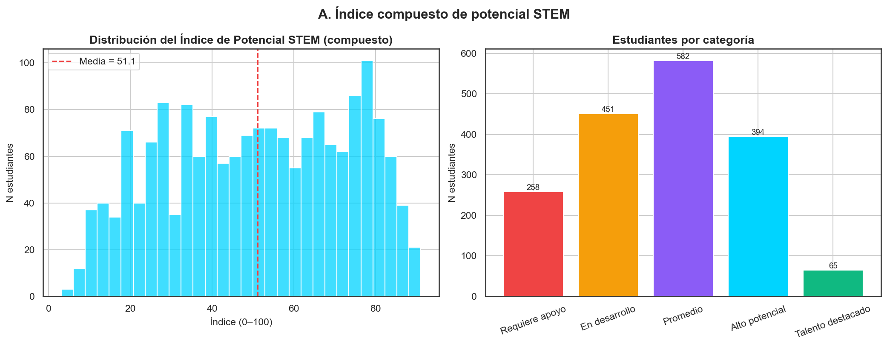
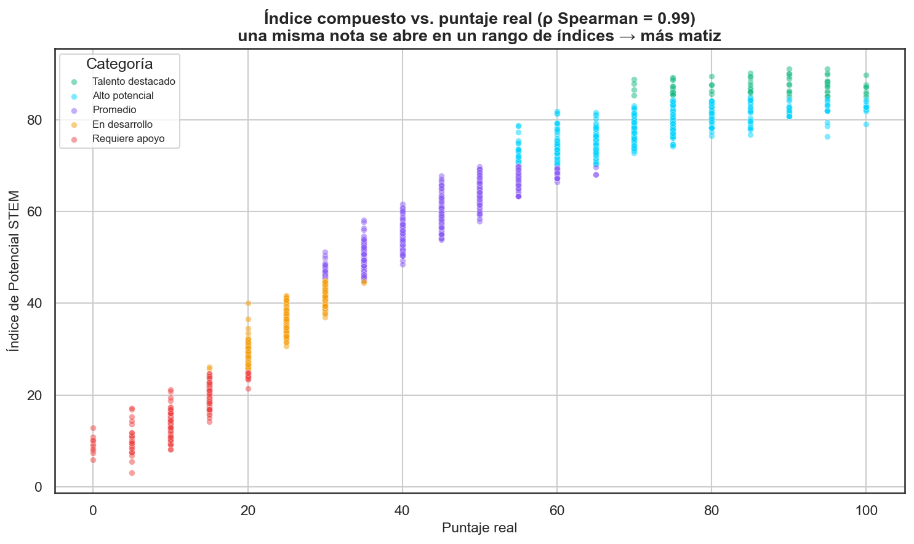
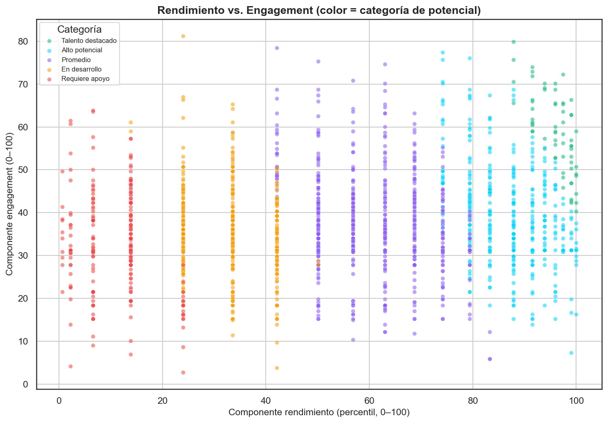
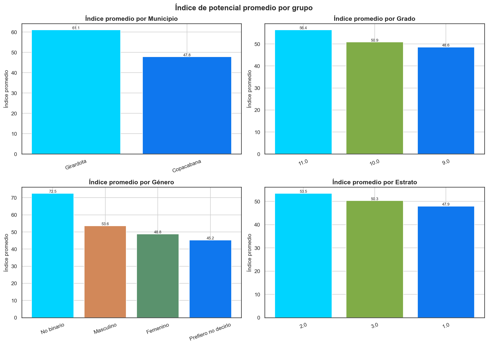
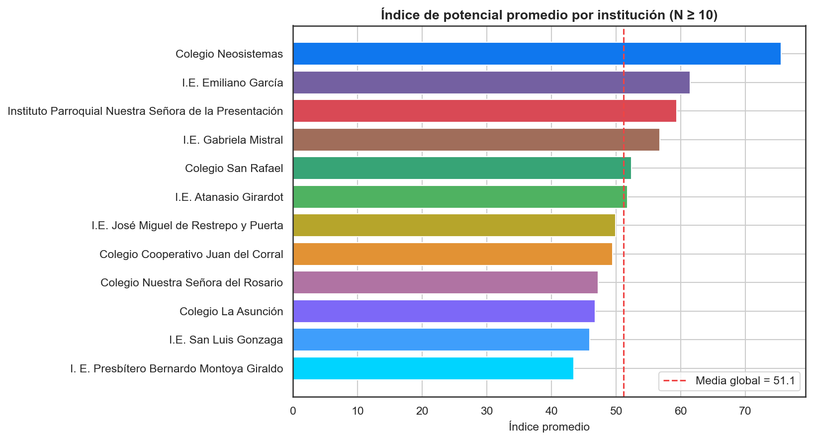

# Índice de Potencial STEM (compuesto) — Copa STEM 2026

**Fundación SapienceLab** · Fase 2 · Informe generado: 2026-07-06 07:51

---

## Resumen ejecutivo

El modelo predictivo (script 03) explica poco del puntaje (R²≈0.085): la
nota depende de factores no capturados por las variables socioeconómicas.
Por eso el potencial STEM se mide con un **índice compuesto** de tres
señales, calculado para **1,750 estudiantes**:

> **índice = 0.50·rendimiento + 0.25·engagement + 0.25·resiliencia**

Así, dos estudiantes con la misma nota pueden diferenciarse por su
interés/experiencia (engagement) y por rendir bien pese a un contexto
adverso (resiliencia). El correlación de Spearman entre el índice y la
nota cruda es **ρ = 0.99**: alto pero no
perfecto, lo que confirma que el índice **aporta matices** que la nota
sola no refleja.

## Metodología — componentes

**1. Rendimiento (0–100).** Percentil del `puntaje_obtenido` dentro de la
cohorte para quienes presentaron; para quienes no presentaron, percentil
del puntaje **estimado** por el modelo de la Fase 2 (modelo:
Random Forest). Peso: **0.50**.

**2. Engagement (0–100).** Promedio de 8 señales normalizadas a 0–100:
nivel de programación (0–3), nivel de robótica (0–3), interés en
prog/robótica (1–5), nº de herramientas conocidas, nº de áreas de interés,
participación previa en olimpiadas (0/100), computador en casa (0/100) e
internet en casa (0/100). Peso: **0.25**.

**3. Resiliencia (0–100).** Premia el mérito en contexto adverso.
`condiciones_adversas` = suma de: estrato ≤ 2, sin computador, sin internet
y no vive con ambos padres (0–4).
- Si presentó: `resiliencia = min(100, percentil_puntaje × (1 + adversas × 0.15))`.
  Ej.: percentil 60 con 3 adversidades → 60 × 1.45 = 87.
- Si no presentó: `resiliencia = max(0, 50 − adversas × 5)`.
Peso: **0.25**.

Nota: el **acceso a computador/internet impacta en DOS componentes** —
suma en engagement (como acceso) y, cuando falta, suma en resiliencia
(como adversidad superada).

## Categorización

| Categoría | Umbral (índice) | N estudiantes |
| --- | --- | --- |
| Talento destacado | ≥ 85 | 65 |
| Alto potencial | 70–84 | 394 |
| Promedio | 45–69 | 582 |
| En desarrollo | 25–44 | 451 |
| Requiere apoyo | < 25 | 258 |




## ¿El índice captura más matices que la nota?

Dentro de una misma nota, el índice se abre en un rango (desviación media
de **3.0 puntos** de índice por
nota): estudiantes con idéntico puntaje reciben índices distintos según su
engagement y resiliencia. Esto es exactamente lo que se busca cuando el
modelo predictivo por sí solo es débil.







## Índice promedio por grupo

- **municipio** → Girardota: 61.12; Copacabana: 47.82

- **grado_escolar** → 11.0: 56.43; 10.0: 50.86; 9.0: 48.56

- **genero** → No binario: 72.52; Masculino: 53.55; Femenino: 48.83; Prefiero no decirlo: 45.25

- **estrato** → 2.0: 53.47; 3.0: 50.31; 1.0: 47.94







## Top 20 — mayor resiliencia (rindieron mejor de lo esperado)

| Documento | Nota | Nota esperada | Δ (real−esp.) | Adversidad | Resiliencia | Índice | Categoría |
| --- | --- | --- | --- | --- | --- | --- | --- |
| 1033492500 | 100 | 33.55 | 66.45 | 0 | 100.0 | 82.81 | Alto potencial |
| 1035425540 | 100 | 33.55 | 66.45 | 0 | 100.0 | 82.81 | Alto potencial |
| 1035000052 | 100 | 42.49 | 57.51 | 0 | 100.0 | 85.59 | Talento destacado |
| 1029664525 | 90 | 33.94 | 56.06 | 1 | 100.0 | 84.56 | Alto potencial |
| 1192465975 | 95 | 40.41 | 54.59 | 4 | 100.0 | 76.34 | Alto potencial |
| 1023640191 | 100 | 46.58 | 53.42 | 3 | 100.0 | 83.25 | Alto potencial |
| 1035424451 | 100 | 47.8 | 52.2 | 3 | 100.0 | 82.47 | Alto potencial |
| 1013344970 | 100 | 48.23 | 51.77 | 1 | 100.0 | 81.94 | Alto potencial |
| 1150687032 | 100 | 48.72 | 51.28 | 0 | 100.0 | 84.03 | Alto potencial |
| 1025894876 | 100 | 49.97 | 50.03 | 2 | 100.0 | 84.38 | Alto potencial |
| 1033491816 | 95 | 45.17 | 49.83 | 1 | 100.0 | 83.28 | Alto potencial |
| 1198463918 | 85 | 35.81 | 49.19 | 2 | 100.0 | 78.35 | Alto potencial |
| 1122930684 | 90 | 41.08 | 48.92 | 2 | 100.0 | 90.12 | Talento destacado |
| 1037125991 | 95 | 46.23 | 48.77 | 1 | 100.0 | 85.19 | Talento destacado |
| 1033427585 | 85 | 36.62 | 48.38 | 4 | 100.0 | 78.09 | Alto potencial |
| 1033183747 | 90 | 41.66 | 48.34 | 1 | 100.0 | 81.79 | Alto potencial |
| 1031942406 | 75 | 26.79 | 48.21 | 1 | 100.0 | 76.15 | Alto potencial |
| 1037265227 | 95 | 47.21 | 47.79 | 1 | 100.0 | 79.46 | Alto potencial |
| 1035228857 | 85 | 37.47 | 47.53 | 2 | 100.0 | 77.83 | Alto potencial |
| 1129584267 | 75 | 27.73 | 47.27 | 2 | 100.0 | 74.24 | Alto potencial |

## Top 20 — mayor índice entre quienes NO presentaron

En el dataset actual **todos los inscritos presentaron la prueba**, por
lo que no hay casos en esta lista. La lógica queda implementada: cuando
se carguen inscritos sin nota, su rendimiento se estima con el modelo y
su resiliencia usa la fórmula de no-presentación.

## Exportación para producción

- `models/deploy/scores_potencial_stem.csv` — columnas: `numero_documento`,
  `indice_potencial`, `componente_rendimiento`, `componente_engagement`,
  `componente_resiliencia`, `categoria` (para cargar en Supabase).
- `models/deploy/potencial_stem_predictor.py` — función pura
  `calcular_indice_potencial(dict)`; solo stdlib.
- `models/deploy/potencial_stem_predictor.js` — misma función en JS ES6,
  sin dependencias (para el frontend).


**Ejemplo de entrada (estudiante real, mediana de nota):**

```json
{
  "puntaje_obtenido": 35,
  "grado_escolar": 9,
  "genero": "Femenino",
  "municipio": "Copacabana",
  "tipo_institucion": "Privada",
  "estrato": 3,
  "computador_en_casa": "Sí, compartido",
  "internet_en_casa": "Sí, estable",
  "participacion_olimpiadas": "No",
  "nivel_programacion": "Ninguna",
  "nivel_robotica": "Ninguna",
  "interes_prog_robotica": 2.0,
  "herramientas_conocidas": "[\"JavaScript\",\"Roblox Studio\",\"Minecraft Education\"]",
  "areas_interes": "[\"Artes\",\"Cultura\"]",
  "con_quien_vive": "Ambos padres"
}
```

## Limitaciones

- Los **pesos (0.50/0.25/0.25)** son una decisión de política, no un óptimo
  estadístico; conviene revisarlos con la Fundación.
- El **rendimiento es relativo** a esta cohorte (percentil), no una medida
  absoluta de habilidad.
- El **engagement** depende de autorreporte (niveles, interés, herramientas).
- La **resiliencia** usa un multiplicador lineal (0.15 por adversidad); es
  una heurística transparente, no un modelo causal.


---
_Generado por `notebooks/04_indice_potencial_stem.py` — Copa STEM 2026._
