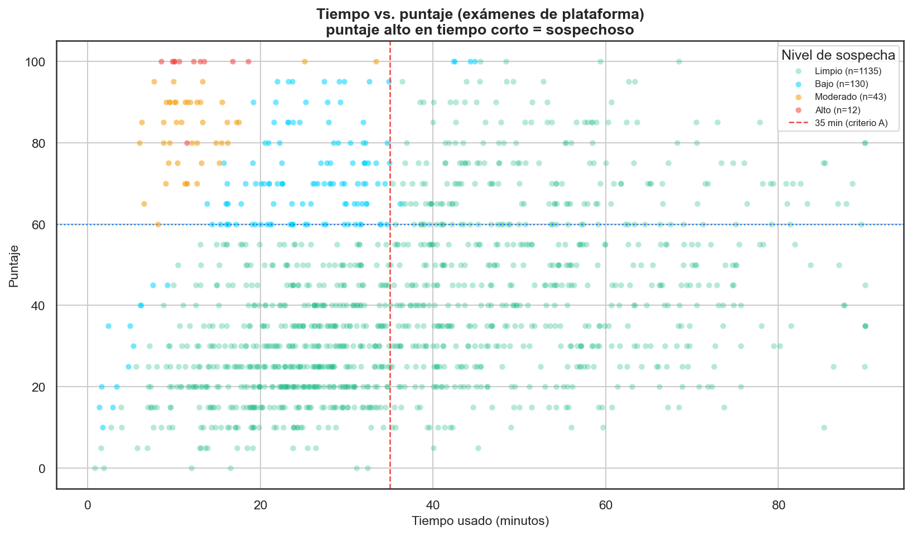
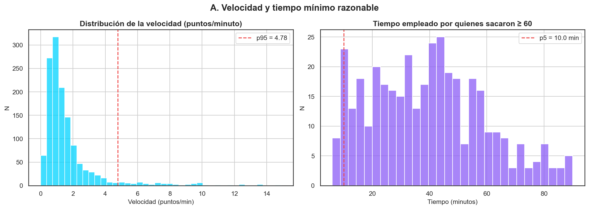
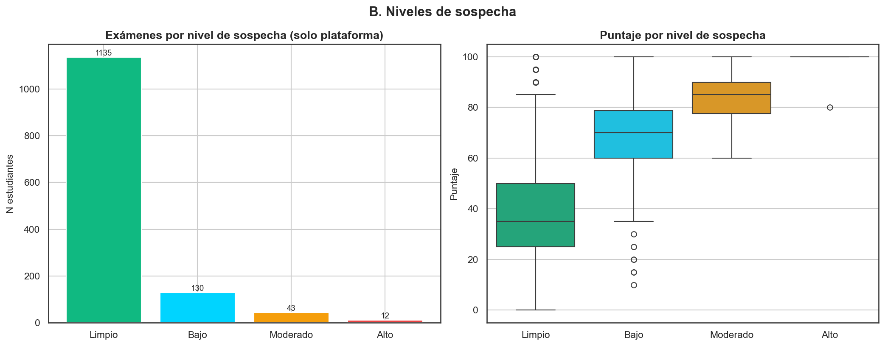
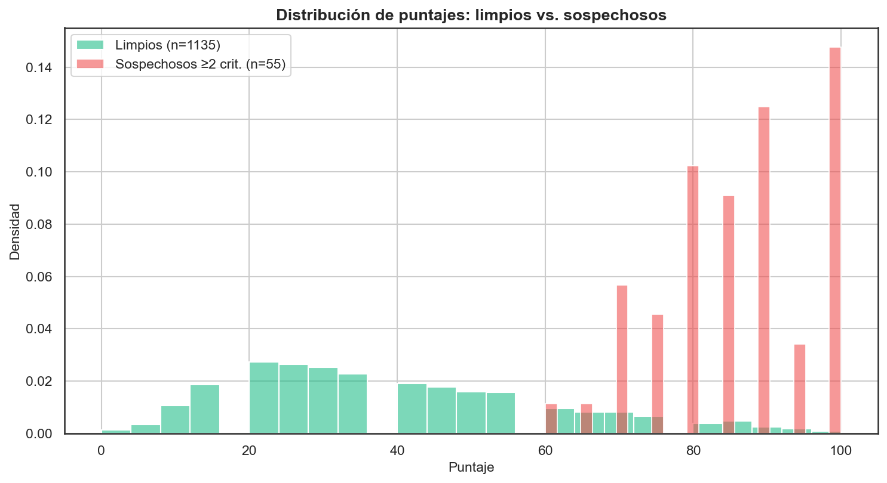
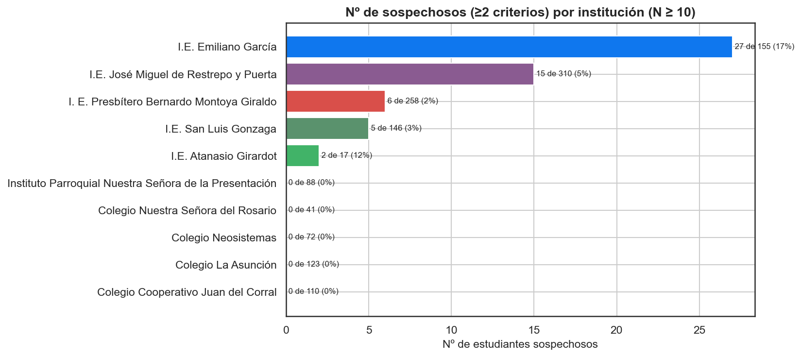
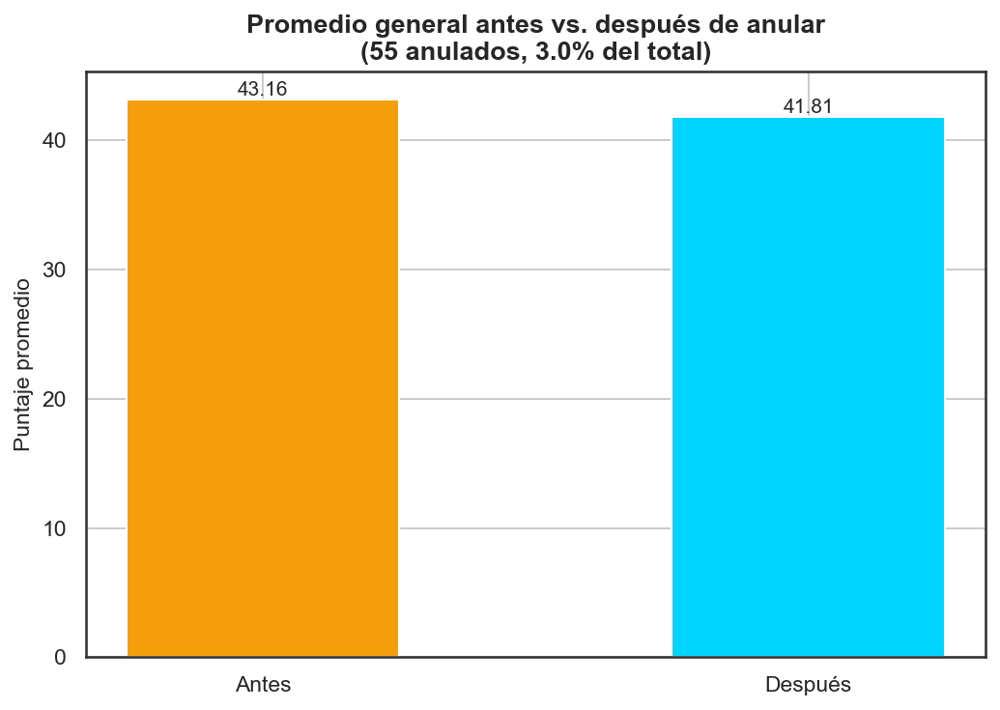
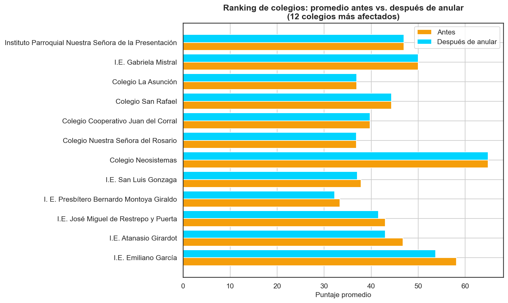
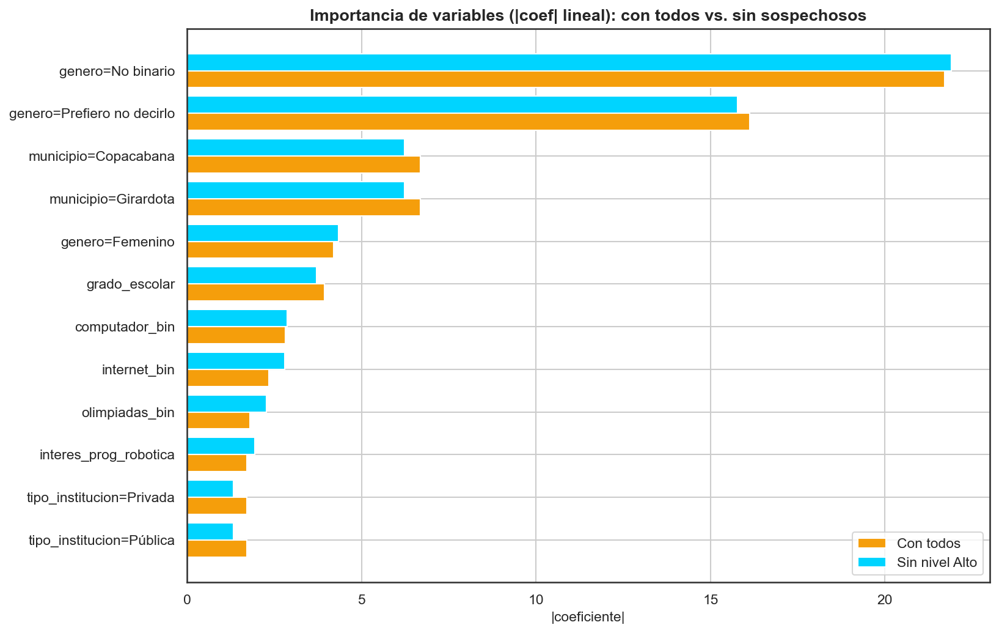

# Detección de Trampa — Copa STEM 2026

**Fundación SapienceLab** · Integridad del examen · Informe: 2026-07-06 07:50

---

## Resumen ejecutivo

Se analizó la integridad de los **1,320 exámenes de
plataforma** (con telemetría). Los **485 exámenes
escritos** no tienen tiempo ni cambios de pestaña y quedan marcados como
*"Sin telemetría"* (fuera del análisis). Se aplicaron **4 criterios**
objetivos de sospecha; un examen es sospechoso si cumple **≥ 2**.

Resultado: **55 exámenes sospechosos** (≥2 criterios), de ellos
**12 de nivel "Alto"** (≥3 criterios).
Se recomienda **anular 55** exámenes (3.0%
del total), lo que corrige el promedio general de 43.16 a
41.81 (-1.36 puntos).

## Metodología — criterios de sospecha

Solo se evalúan exámenes de plataforma. Cada criterio marca un patrón
difícil de lograr honestamente:

| Criterio | Condición | Justificación |
| --- | --- | --- |
| **A** | puntaje ≥ 60 **y** tiempo < 35 min | 40 preguntas en <35 min con buen puntaje es muy rápido. |
| **B** | cambios de pestaña ≥ 5 **y** puntaje ≥ 60 | Salir del examen repetidas veces + buen puntaje sugiere consulta externa. |
| **C** | velocidad > percentil 95 | Velocidad (puntos/min) atípica respecto al grupo (p95 = 4.78). |
| **D** | puntaje = 100 **y** tiempo < 45 min | Puntaje perfecto en menos de media prueba: casi imposible sin ayuda. |

**Nivel de sospecha** por nº de criterios: 0 = *Limpio*, 1 = *Bajo*,
2 = *Moderado*, ≥3 = *Alto*. El **tiempo mínimo razonable** observado para
sacar ≥ 60 (percentil 5 de quienes lo lograron) es
**10.0 minutos**.

**Criterios activados (nº de exámenes que cumple cada uno):**

| Criterio | N exámenes |
| --- | --- |
| A | 167 |
| B | 2 |
| C | 66 |
| D | 17 |

## Análisis detallado

**Exámenes por nivel de sospecha (plataforma):**

| Nivel | N |
| --- | --- |
| Limpio | 1135 |
| Bajo | 130 |
| Moderado | 43 |
| Alto | 12 |

**Colegios con tasa de sospecha anormalmente alta** (> media +
1σ = 10.0%; media global 4.0%):

| Institución | N plataforma | Sospechosos | Tasa % |
| --- | --- | --- | --- |
| I.E. Emiliano García | 155 | 27 | 17.4 |
| I.E. Atanasio Girardot | 17 | 2 | 11.8 |

**Impacto de anular el nivel "Alto":** el promedio general pasa de
43.16 a 42.79
(-0.37) al retirar 12 exámenes.

## Criterio de anulación recomendado

**Regla propuesta:** anular si el examen cumple **≥ 2 criterios** de
sospecha **y** tiene **puntaje ≥ 60** (la nota baja no se beneficia de
hacer trampa, así que no se penaliza). Esta regla es conservadora:
exige evidencia múltiple y solo afecta puntajes que "valen la pena".

- **Exámenes a anular:** 55 (3.0% del total).
- **Promedio general:** 43.16 → 41.81
  (-1.36).

**Colegios más afectados en su promedio (antes → después):**

| Institución | Antes | Después | Δ |
| --- | --- | --- | --- |
| I.E. Emiliano García | 58.15 | 53.68 | -4.47 |
| I.E. Atanasio Girardot | 46.76 | 43.0 | -3.76 |
| I.E. José Miguel de Restrepo y Puerta | 43.03 | 41.53 | -1.5 |
| I. E. Presbítero Bernardo Montoya Giraldo | 33.33 | 32.24 | -1.08 |
| I.E. San Luis Gonzaga | 37.84 | 37.03 | -0.81 |
| Colegio Neosistemas | 64.87 | 64.87 | 0.0 |
| Colegio Nuestra Señora del Rosario | 36.85 | 36.85 | 0.0 |
| Colegio Cooperativo Juan del Corral | 39.74 | 39.74 | 0.0 |
| Colegio San Rafael | 44.33 | 44.33 | 0.0 |
| Colegio La Asunción | 36.94 | 36.94 | 0.0 |

## Impacto en el modelo ML

Se re-entrenó el modelo lineal de la Fase 2 quitando los
**12 exámenes de nivel "Alto"**:

- R² (CV) con todos:        **0.091 ± 0.027**
- R² (CV) sin nivel "Alto": **0.089 ± 0.008**
- Cambio: **-0.002**

El R² **no cambia de forma relevante**: los sospechosos de nivel Alto son pocos y no dominan el ajuste global, aunque su anulación sigue siendo correcta por integridad.

## Recomendación final para la Fundación

1. **Anular los 55 exámenes** que cumplen la regla (≥2
   criterios y puntaje ≥ 60) y ofrecer **repetición supervisada**.
2. **Priorizar revisión manual** de los exámenes de nivel "Alto"
   (≥3 criterios) y de los colegios con tasa de sospecha anómala.
3. **Cerrar la brecha de origen:** exigir el sistema anti-cheat
   (telemetría) para TODOS los exámenes futuros; los escritos sin control
   no son auditables.
4. Tratar estos criterios como **señal de alerta, no prueba definitiva**:
   la decisión final debe combinar la evidencia estadística con revisión
   humana y derecho de réplica del estudiante.

## Limitaciones

- Los umbrales (35/45 min, p95) son **heurísticos** calibrados con esta
  cohorte; conviene validarlos con casos confirmados.
- Un estudiante muy hábil **puede** ser rápido legítimamente: por eso se
  exige evidencia múltiple (≥2 criterios) antes de recomendar anulación.
- Los **exámenes escritos** no son auditables por falta de telemetría; su
  integridad debe garantizarse por otros medios (supervisión presencial).

---
_Generado por `notebooks/05_deteccion_trampa.py` — Copa STEM 2026._
