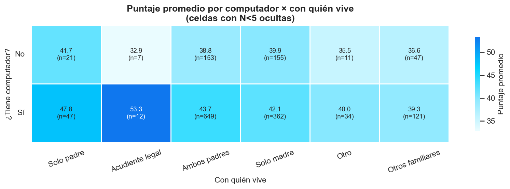
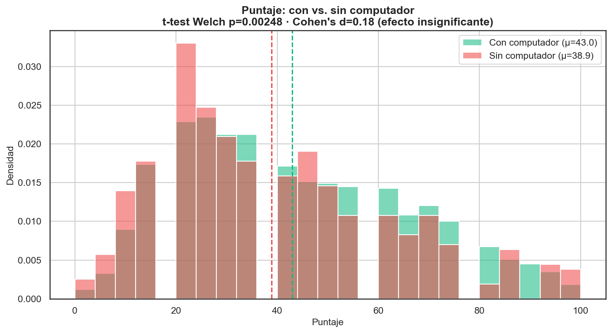
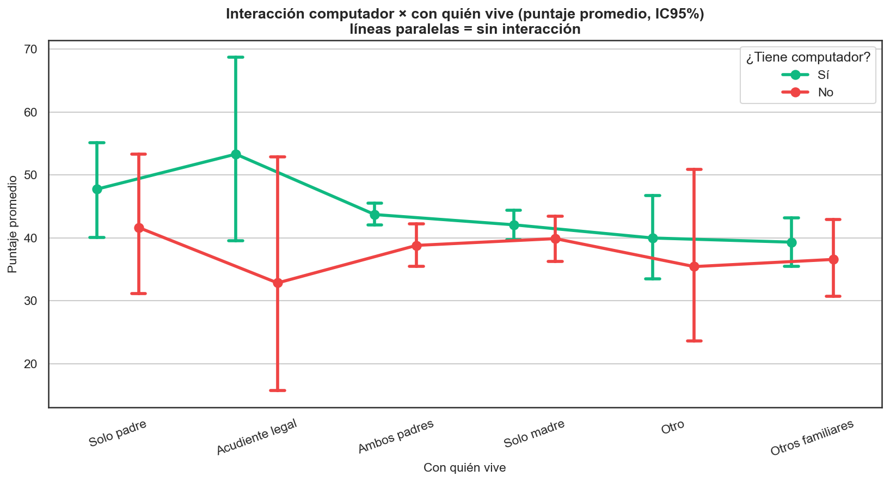
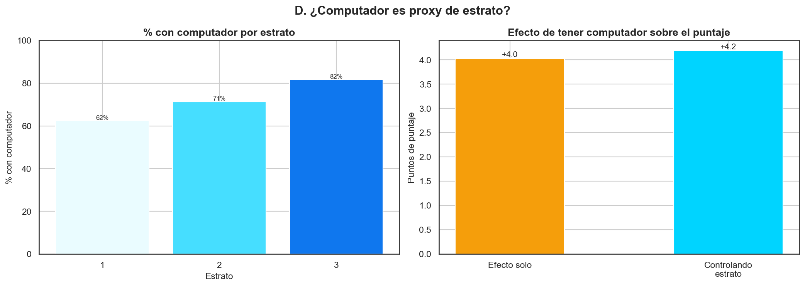

# Cruce Computador × Con-quién-vive — Copa STEM 2026

**Fundación SapienceLab** · Análisis específico · 2026-07-06 08:18

---

## Resumen

Tener computador se asocia a **+4.0 puntos** (con µ=43.0
vs sin µ=38.9); la diferencia es significativa (p=0.00248) pero
con **efecto insignificante** (Cohen's d=0.18). El acceso a
computador está correlacionado con el estrato (r=0.14),
y al **controlar por estrato el efecto del computador
se mantiene en su mayor parte**
(+4.0 → +4.2 pts).
NO hay interacción significativa entre computador
y con quién vive (p=0.638).

## 1. Tabla cruzada (puntaje promedio · N)

| ¿Computador? | Con quién vive | Media | Mediana | N |
| --- | --- | --- | --- | --- |
| No | Acudiente legal | 32.9 | 25.0 | 7 |
| No | Ambos padres | 38.8 | 35.0 | 153 |
| No | Otro | 35.5 | 30.0 | 11 |
| No | Otros familiares | 36.6 | 35.0 | 47 |
| No | Solo madre | 39.9 | 35.0 | 155 |
| No | Solo padre | 41.7 | 40.0 | 21 |
| Sí | Acudiente legal | 53.3 | 57.5 | 12 |
| Sí | Ambos padres | 43.7 | 40.0 | 649 |
| Sí | Otro | 40.0 | 40.0 | 34 |
| Sí | Otros familiares | 39.3 | 35.0 | 121 |
| Sí | Solo madre | 42.1 | 40.0 | 362 |
| Sí | Solo padre | 47.8 | 50.0 | 47 |

## 2a. ¿Los que tienen computador rinden siempre mejor?

- Con computador: **µ=43.0** (n=1225).
- Sin computador: **µ=38.9** (n=394).
- t-test Welch: t=3.04, **p=0.00248** (significativa).
- Tamaño del efecto: **Cohen's d=0.18** → magnitud **insignificante**.

La diferencia existe pero es **pequeña en la práctica**: hay mucho
solapamiento entre las dos distribuciones.

## 2b. ¿Ambos padres + computador = combinación ganadora?

ANOVA de 2 factores (`puntaje ~ computador × con_quien_vive`):
- Computador: p=0.00317
- Con quién vive: p=0.165
- **Interacción: p=0.638** → **no** hay interacción.

'Ambos padres + computador' promedia **43.7**
(n=649) vs. **40.8** el resto. Como la
interacción no es significativa, el beneficio de
tener computador NO depende de con quién vive:
las líneas del gráfico son paralelas.

## 2c. El grupo resiliente (bajo acceso + buena nota)

**84** estudiantes **sin computador** sacaron ≥
60 puntos (21% de los que no
tienen computador). El subgrupo "sin computador + Solo madre" (n=
155) promedia 39.9. La
adversidad de acceso **no condena** el resultado: hay talento resiliente.

**Colegios con más resilientes:**

| Institución | Resilientes |
| --- | --- |
| I.E. José Miguel de Restrepo y Puerta | 25 |
| I.E. Emiliano García | 24 |
| I.E. San Luis Gonzaga | 19 |
| I.E. Gabriela Mistral | 9 |
| Colegio San Rafael | 3 |
| I. E. Presbítero Bernardo Montoya Giraldo | 2 |
| Colegio Nuestra Señora del Rosario | 1 |
| Instituto Parroquial Nuestra Señora de la Presentación | 1 |

## 2d. ¿Computador es proxy de estrato?

- Correlación computador↔estrato: **r=0.14**
  (p=1.43e-08).
- % con computador por estrato: E1: 62%; E2: 71%; E3: 82%

- Regresión parcial: el efecto de tener computador pasa de
  **+4.0 pts** (solo) a **+4.2 pts**
  al controlar por estrato (se reduce -4%);
  el estrato aporta -0.83 pts por nivel.

## 3. Conclusión

Aun controlando por estrato, tener computador conserva parte de su asociación con el puntaje: **no es solo un proxy del estrato**, aunque el efecto es pequeño.

En términos prácticos: la diferencia por computador es real pero **de
magnitud insignificante** (d=0.18), sin
interacción con la estructura familiar, y **84 estudiantes
sin computador rinden ≥ 60**. La política más eficiente combina
**dotación tecnológica focalizada por estrato** con **acompañamiento
pedagógico**, sin asumir que el computador por sí solo explica el
rendimiento.

---
_Generado por `notebooks/05c_cruce_computador_familia.py` — Copa STEM 2026._
