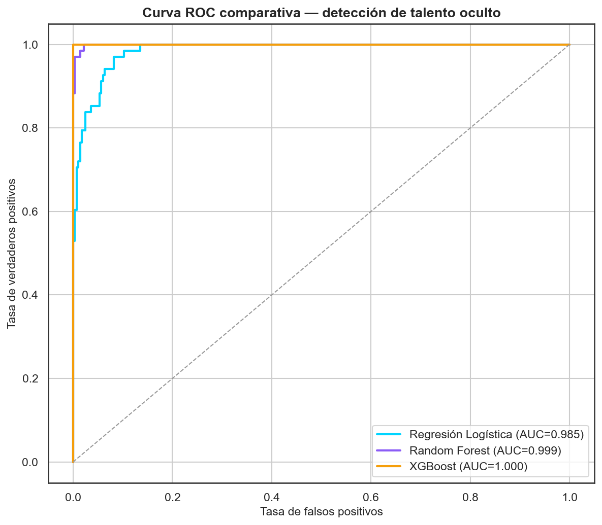
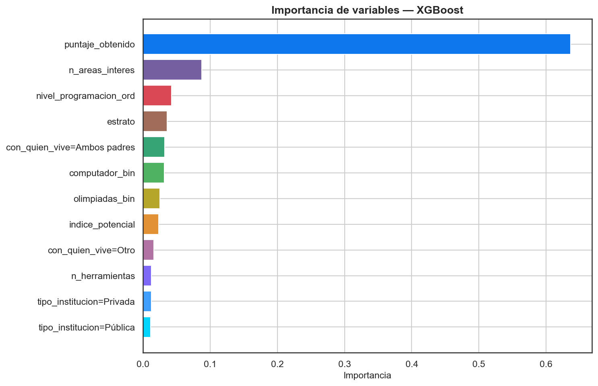
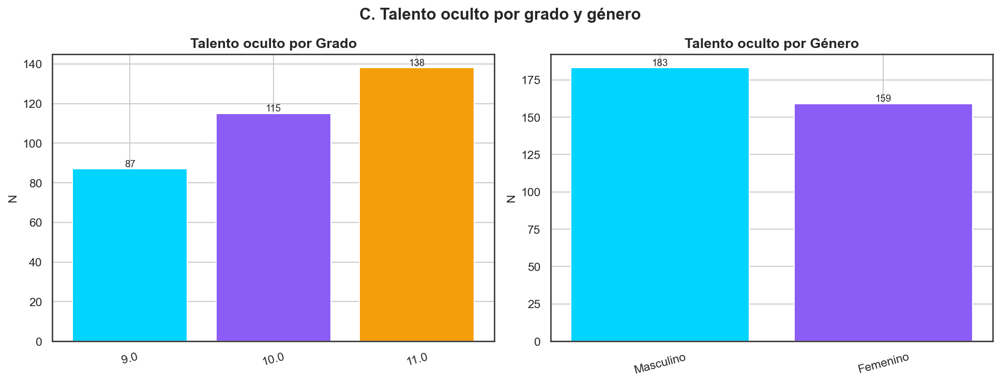
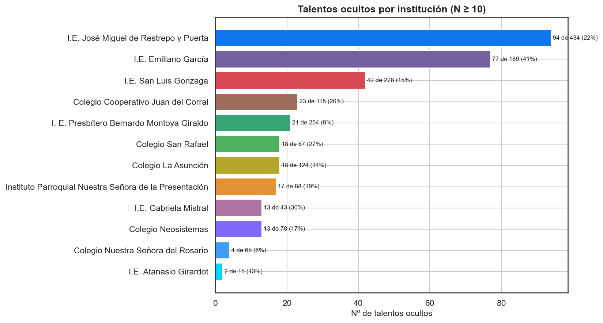
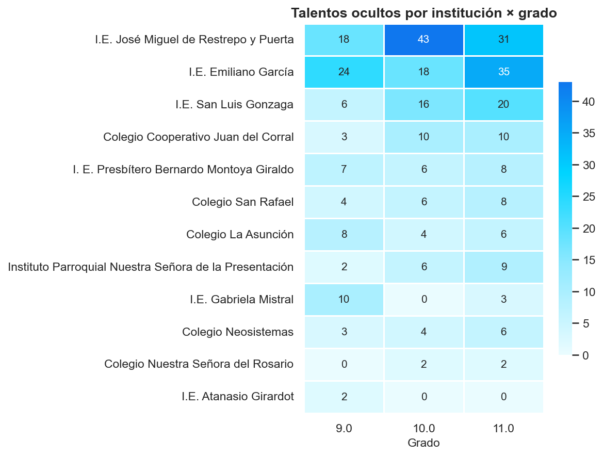

# Detección de Talento Oculto — Copa STEM 2026

**Fundación SapienceLab** · Fase 2/3 · Informe: 2026-07-06 08:02

---

## Resumen ejecutivo

Se identificaron **342 estudiantes de talento oculto**
(19.5% de 1,750): alto rendimiento **a pesar**
de condiciones socioeconómicas adversas. Son el retorno social más alto de
una beca o acompañamiento. Se entrenaron 3 clasificadores; el mejor
(**XGBoost**, AUC test = 1.000)
genera una **probabilidad de talento** para priorizar casos límite. La
réplica pura del modelo (`talento_oculto_predictor.py/.js`) coincide con el
modelo real dentro de **0.00075**.

## Definición (regla determinista)

**talento_oculto = alto_rendimiento Y (≥2 condiciones adversas)**

- **Alto rendimiento** (≥1): `puntaje ≥ P75` (= 60)
  **o** `indice_potencial ≥ 75`.
- **Condiciones adversas** (≥2 de 6): estrato 1-2,
  sin computador, sin internet, no vive con ambos padres, sin olimpiadas
  previas, nivel de programación "Ninguna".

Los datos faltantes en una condición se tratan como *no adversos*
(criterio conservador: no se marca talento por falta de información).

## Modelos de clasificación

> **Nota metodológica.** El target es una regla determinista sobre estas
> mismas variables, por lo que los clasificadores alcanzan métricas muy
> altas (reconstruyen la regla; fuga de etiqueta esperada). Su valor es
> (1) la **probabilidad continua** para ordenar casos y (2) confirmar
> **qué variables pesan** (importancia).

| Modelo | Acc (CV) | Prec (CV) | Recall (CV) | F1 (CV) | AUC (CV) | F1 (test) | AUC (test) |
| --- | --- | --- | --- | --- | --- | --- | --- |
| Regresión Logística | 0.935 | 0.816 | 0.868 | 0.840 | 0.984 | 0.849 | 0.985 |
| Random Forest | 0.967 | 0.866 | 0.989 | 0.923 | 0.998 | 0.907 | 0.999 |
| XGBoost ⭐ | 0.994 | 0.982 | 0.985 | 0.984 | 1.000 | 0.993 | 1.000 |







## Análisis descriptivo

**Talento oculto por grado:** 9°: 87, 10°: 115, 11°: 138.


**Por género:** Masculino: 183, Femenino: 159.










### Perfil comparativo: talento oculto vs. resto

| Variable | Talento oculto | Resto |
| --- | --- | --- |
| Puntaje medio | 72.85 | 34.26 |
| Índice potencial medio | 78.17 | 44.56 |
| Estrato medio | 2.26 | 2.45 |
| Condiciones adversas (media) | 2.98 | 2.4 |
| Herramientas (media) | 2.03 | 1.8 |
| Áreas interés (media) | 2.83 | 2.32 |
| % sin computador | 24.6 | 22.0 |
| % sin internet | 4.1 | 2.7 |
| % sin olimpiadas | 90.9 | 79.0 |

### Casos destacados (top 10 por puntaje)

| Documento | Nombres | Apellidos | Institución | Grado | Género | Puntaje | Índice | Nº adversas | Condiciones |
| --- | --- | --- | --- | --- | --- | --- | --- | --- | --- |
| 1020307682 | Juan Jose | Ruiz Sanchez | Instituto Parroquial Nuestra Señora de la Presentación | 10.0 | Masculino | 100 | 87.24 | 3 | estrato_bajo|no_ambos_padres|sin_olimpiadas |
| 1013344970 | Joshua | Bermúdez Seguro | Colegio San Rafael | 11.0 | Masculino | 100 | 81.94 | 3 | estrato_bajo|sin_olimpiadas|prog_ninguna |
| 1029989055 | Johan Esteban | Galindo Meneses | Colegio Neosistemas | 11.0 | Masculino | 100 | 89.76 | 2 | estrato_bajo|no_ambos_padres |
| 1036519373 | luciana | Castro zapata | I.E. Emiliano García | 11.0 | Femenino | 100 | 85.07 | 3 | estrato_bajo|no_ambos_padres|sin_olimpiadas |
| 1035422691 | Emanuel | Correa Agudelo | I.E. Gabriela Mistral | 11.0 | Masculino | 100 | 82.9 | 3 | estrato_bajo|sin_computador|sin_olimpiadas |
| 1014669455 | María José | González González | I.E. Emiliano García | 11.0 | Femenino | 100 | 87.15 | 3 | estrato_bajo|sin_olimpiadas|prog_ninguna |
| 1036519458 | María Antonia | Ramírez Castrillón | I.E. Emiliano García | 11.0 | Femenino | 100 | 82.2 | 4 | estrato_bajo|sin_computador|no_ambos_padres|sin_olimpiadas |
| 1035424451 | Emanuel | Ramírez Arroyave | I.E. Emiliano García | 11.0 | Masculino | 100 | 82.47 | 4 | estrato_bajo|sin_computador|no_ambos_padres|sin_olimpiadas |
| 1150687032 | Sara | Cerón Escobar | I.E. José Miguel de Restrepo y Puerta | 11.0 | Femenino | 100 | 84.03 | 2 | sin_olimpiadas|prog_ninguna |
| 1022150422 | Maria Paulina | Serna Betancur | I.E. Gabriela Mistral | 11.0 | Femenino | 100 | 79.08 | 5 | estrato_bajo|sin_computador|sin_internet|sin_olimpiadas|prog_ninguna |

## Exportación para producción

- `models/deploy/talento_oculto_scores.csv` — `numero_documento`,
  `probabilidad_talento`, `es_talento_oculto`, `n_condiciones_adversas`,
  `condiciones_detalle`.
- `models/deploy/talento_oculto_predictor.py` — función pura
  `detectar_talento_oculto(dict)`; sin sklearn.
- `models/deploy/talento_oculto_predictor.js` — misma función en JS ES6.


**Ejemplo de entrada (un talento oculto real):**

```json
{
  "puntaje_obtenido": 100,
  "indice_potencial": 87.24,
  "grado_escolar": 10,
  "genero": "Masculino",
  "municipio": "Girardota",
  "tipo_institucion": "Privada",
  "estrato": 2,
  "computador_en_casa": "Sí, compartido",
  "internet_en_casa": "Sí, estable",
  "participacion_olimpiadas": "No",
  "nivel_programacion": "Básica",
  "nivel_robotica": "Básica",
  "interes_prog_robotica": 3.0,
  "con_quien_vive": "Solo madre",
  "herramientas_conocidas": "[\"Python\",\"JavaScript\",\"HTML\",\"CSS\",\"Arduino\"]",
  "areas_interes": "[\"Matemáticas\",\"Programación\",\"Ingeniería\"]"
}
```

## Recomendaciones para la Fundación

1. **Contactar a los 342 talentos ocultos** para becas,
   tutoría y rutas STEM: alto potencial que el contexto está frenando.
2. **Priorizar por probabilidad** (`probabilidad_talento`) y por nº de
   condiciones adversas cuando los recursos sean limitados.
3. **Focalizar por institución** usando el barplot y el heatmap: algunos
   colegios concentran varios casos.
4. Tratar la lista como **guía de acción, no veredicto**: validar con los
   colegios (la definición es una regla revisable).

## Limitaciones

- La **definición es una decisión de política** (umbrales P75, índice ≥ 75,
  ≥2 condiciones); cambiarla cambia la lista.
- El clasificador **reconstruye la regla** (fuga de etiqueta): sus métricas
  no miden generalización, sino consistencia; la probabilidad sirve para
  ordenar, no como evidencia independiente.
- Variables **autorreportadas** y ~7% de inscripciones sin datos
  socioeconómicos (tratadas como no adversas).


---
_Generado por `notebooks/06_talento_oculto.py` — Copa STEM 2026._
