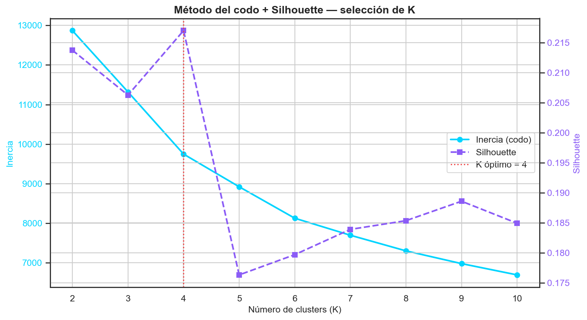
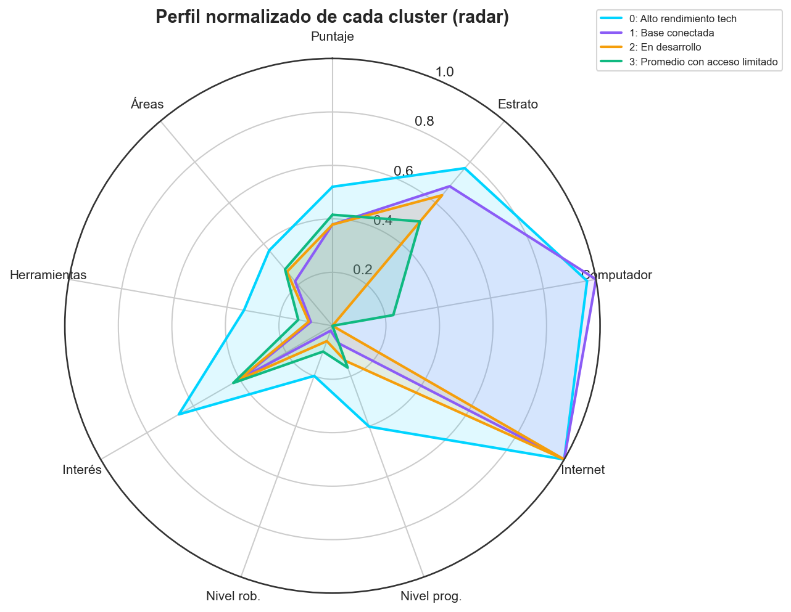
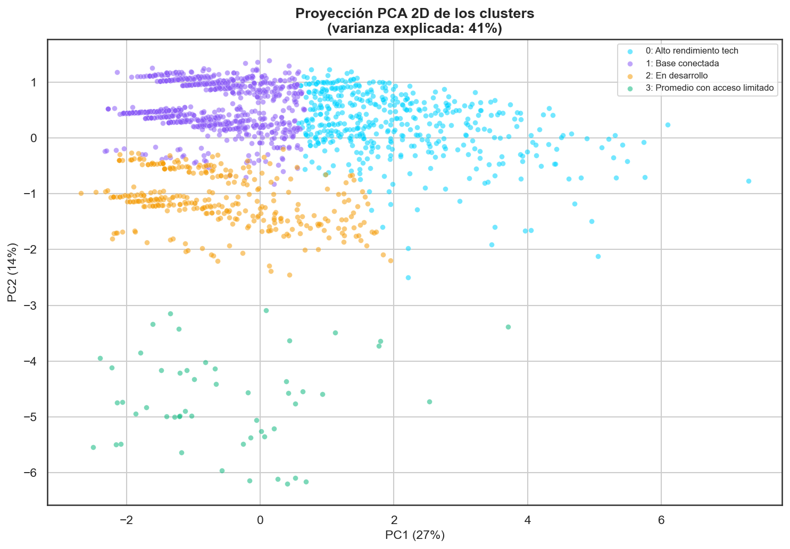
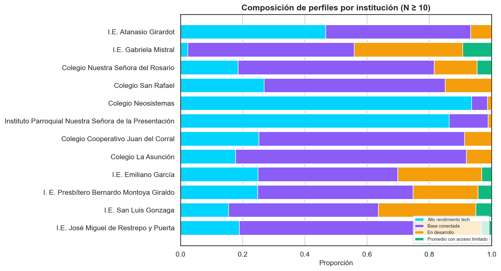
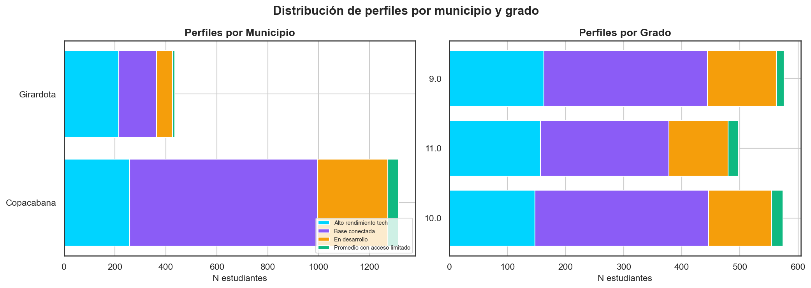

# Clustering de Perfiles de Estudiante — Copa STEM 2026

**Fundación SapienceLab** · Fase 3 · Informe: 2026-07-06 08:02

---

## Resumen ejecutivo

Se segmentaron **1,750 estudiantes** en **4 perfiles**
combinando rendimiento, acceso tecnológico y experiencia previa (9
variables estandarizadas). El número de clusters se eligió por
**silhouette** (K=4). Se comparó **K-Means** (silhouette
0.217) con **Gaussian Mixture** (0.168);
se despliega **K-Means** por su asignación determinista *centroide más
cercano*, ideal para un predictor portable. Cada perfil recibe un nombre
descriptivo y una recomendación de intervención.

## Metodología

- **Features (9):** puntaje, estrato, computador (0/1), internet (0/1),
  nivel de programación (0-3), nivel de robótica (0-3), interés, nº de
  herramientas, nº de áreas de interés.
- **Preprocesamiento:** imputación por **mediana** + **StandardScaler**.
- **K óptimo:** método del codo (inercia) + **silhouette** (K=2..10).
- **Modelos:** K-Means (despliegue) y Gaussian Mixture (alternativa).
- Reproducible con `random_state=42`.




## Perfiles identificados

| Cluster | Nombre | N | % total | Puntaje µ | Estrato µ | % computador | % internet | Nivel prog µ |
| --- | --- | --- | --- | --- | --- | --- | --- | --- |
| 0 | Alto rendimiento tech | 473 | 27.0 | 52.0 | 2.54 | 97.0 | 100.0 | 1.21 |
| 1 | Base conectada | 887 | 50.7 | 37.9 | 2.36 | 85.0 | 85.0 | 0.21 |
| 2 | En desarrollo | 338 | 19.3 | 37.9 | 2.28 | 0.0 | 100.0 | 0.42 |
| 3 | Promedio con acceso limitado | 52 | 3.0 | 41.5 | 2.02 | 23.0 | 0.0 | 0.5 |







## Distribución de perfiles







## Recomendaciones de intervención por perfil

**Alto rendimiento tech** (cluster 0, N=473, 27.0%)
— puntaje µ=52.0, 97% con
computador, nivel prog µ=1.21.
→ *Rutas STEM avanzadas, mentoría y competencias de nivel superior para no perder el talento por falta de reto.*

**Base conectada** (cluster 1, N=887, 50.7%)
— puntaje µ=37.9, 85% con
computador, nivel prog µ=0.21.
→ *Acompañamiento general y seguimiento del progreso.*

**En desarrollo** (cluster 2, N=338, 19.3%)
— puntaje µ=37.9, 0% con
computador, nivel prog µ=0.42.
→ *Nivelación en matemáticas/lógica y tutoría de base; medir barreras específicas de aprendizaje.*

**Promedio con acceso limitado** (cluster 3, N=52, 3.0%)
— puntaje µ=41.5, 23% con
computador, nivel prog µ=0.5.
→ *Refuerzo académico focalizado; ya tienen acceso, falta acompañamiento pedagógico para subir el rendimiento.*

## Exportación para producción

- `models/deploy/clustering_perfiles.csv` — `numero_documento`,
  `cluster_id`, `cluster_nombre`.
- `models/deploy/clustering_predictor.py` — función pura `predecir_perfil(dict)`
  (imputa, estandariza y asigna al centroide más cercano); sin sklearn.
- `models/deploy/clustering_predictor.js` — misma función en JS ES6.


**Ejemplo de entrada:**

```json
{
  "puntaje_obtenido": 40,
  "estrato": 3,
  "computador_en_casa": "Sí, propio",
  "internet_en_casa": "Sí, estable",
  "nivel_programacion": "Ninguna",
  "nivel_robotica": "Ninguna",
  "interes_prog_robotica": 1.0,
  "herramientas_conocidas": "[\"Python\",\"JavaScript\",\"Roblox Studio\",\"Minecraft Education\",\"HTML\",\"CSS\",\"Otro\"]",
  "areas_interes": "[\"Artes\",\"Cultura\",\"Otro\",\"Ciencias Naturales\"]"
}
```

## Limitaciones

- Los **nombres de perfil son etiquetas interpretativas** derivadas del
  perfil relativo de cada cluster, no categorías oficiales.
- K-Means asume clusters convexos de tamaño similar; la silhouette
  moderada indica solapamiento entre perfiles (frontera difusa).
- Variables **autorreportadas** e imputación por mediana en ~7% de casos
  sin datos socioeconómicos.


---
_Generado por `notebooks/07_clustering_perfiles.py` — Copa STEM 2026._
