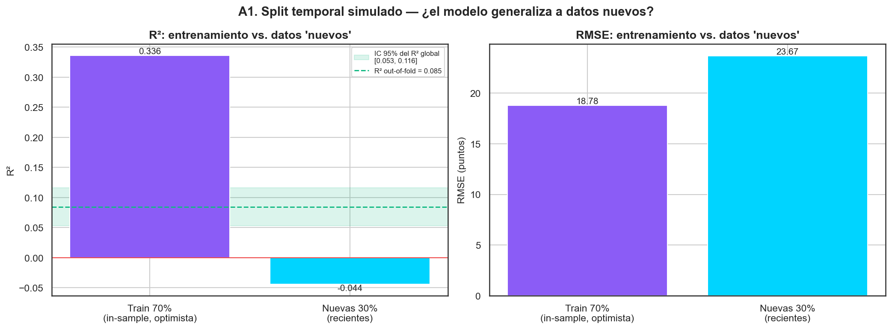
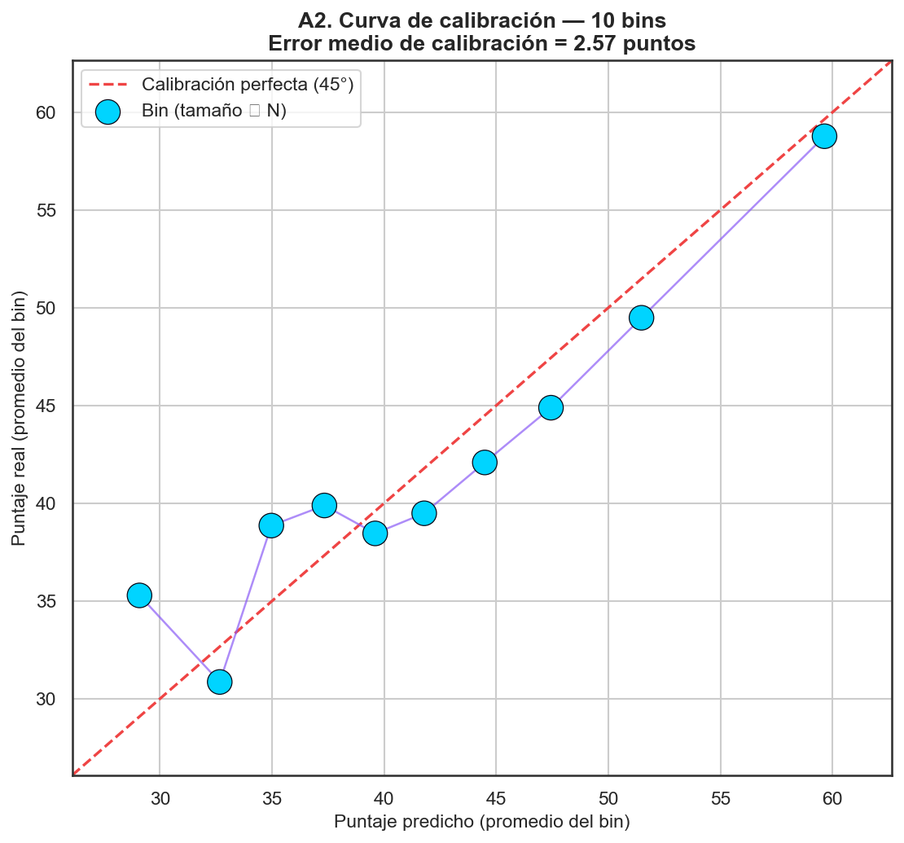
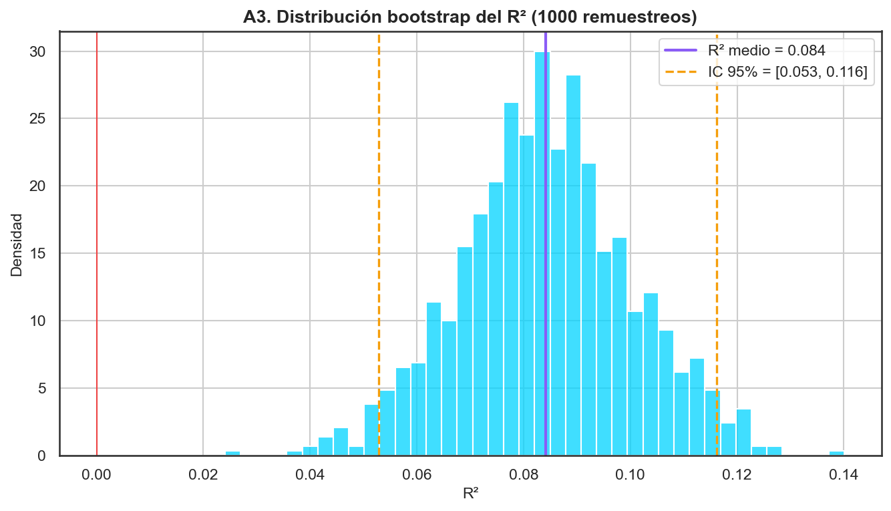
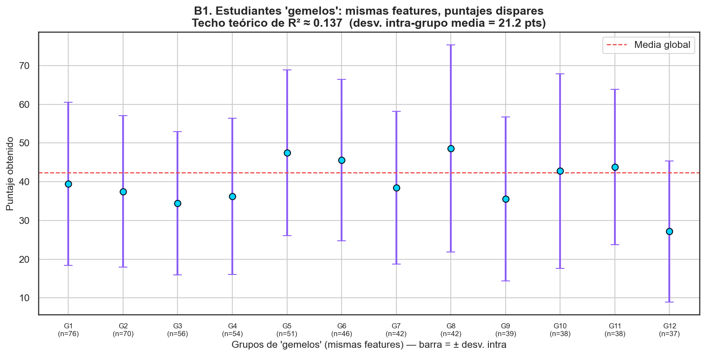
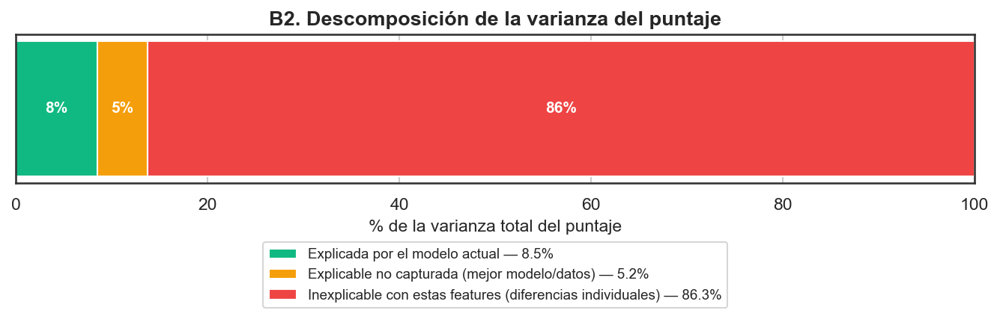
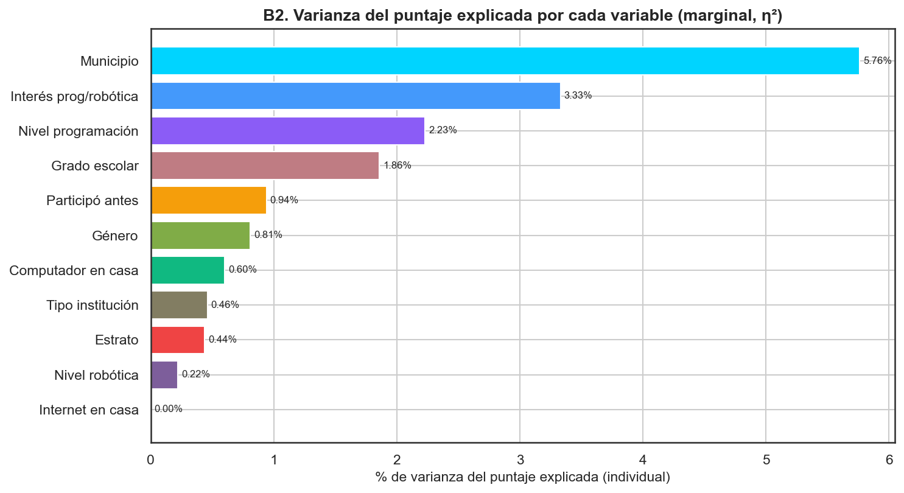
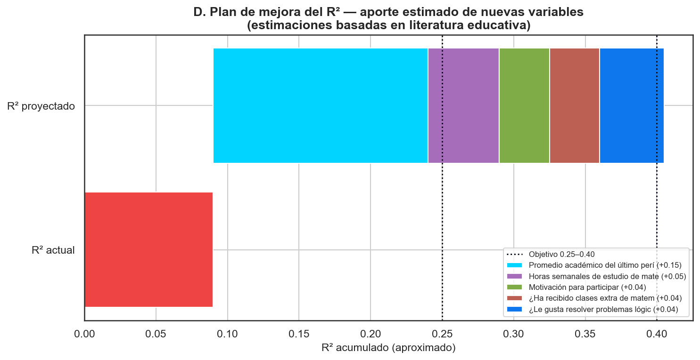

# Framework de Validación del Modelo Predictivo — Copa STEM 2026

**Fundación SapienceLab** · Fase 4 · Informe generado: 2026-07-06 08:19

---

## Resumen ejecutivo

El modelo predictivo del puntaje (script 03, **Random Forest**) alcanza
un R² ≈ 0.085. Este informe demuestra que ese valor **no es un
error, sino un hallazgo estable**:

1. **Estabilidad (bootstrap 1000×):** R² = 0.084, IC 95%
   [0.053, 0.116] → intervalo por encima de 0: el poder predictivo es real (pequeño pero no nulo).
2. **Generalización temporal (split simulado):** entrenando solo con el 70%
   de inscripciones más antiguas y prediciendo el 30% más reciente, el R²
   cae a -0.044
   — POR DEBAJO del IC 95% global. En agregado el R² es estable, pero no se transporta perfecto a la cohorte más reciente: hay que re-validar con cada nueva edición.
3. **Calibración:** error medio de 2.57 puntos entre lo
   predicho y lo real por bin → el modelo es razonablemente honesto.
4. **Techo teórico:** los "estudiantes gemelos" (mismas features) tienen una
   desviación de puntaje de **21.2 puntos** dentro del
   grupo; el R² máximo alcanzable con estas variables es
   **≈ 0.137**. Por tanto, el R² bajo se explica por las
   **variables que faltan**, no por el algoritmo.

Se entrega además `models/deploy/validation_framework.py`, una función pura
`validate_new_data()` que valida datos futuros y detecta *drift*, y un plan
para subir el R² a **0.25–0.40** en
la próxima edición.

## Metodología

- **Reutilización del pipeline de producción:** mismas features, mismo
  preprocesamiento y el mismo modelo ganador que el script 03 (importado como
  módulo) para que la validación sea coherente con el modelo real.
- **Split temporal simulado:** el dataset no tiene columna de fecha; se usa
  el orden de fila del CSV (orden de inscripción en Supabase) como proxy del
  tiempo (70% antiguas → 30% nuevas). Ver *Limitaciones*.
- **Predicciones out-of-fold (5-fold)** para calibración y bootstrap, de modo
  que ningún estudiante se evalúa con un modelo que lo vio en entrenamiento.
- **Detección de drift por PSI** (Population Stability Index) sobre cada
  variable de entrada. Reproducible con `random_state=42`.

## A. Validación del modelo actual

### A1. Split temporal simulado (70% antiguas / 30% nuevas)

El R² *in-sample* del train (0.336) es optimista por
construcción (Random Forest se ajusta a lo que ya vio), así que **no** sirve
de referencia. La referencia honesta es el R² out-of-fold
(0.085) y su IC 95% por bootstrap
([0.053, 0.116]).

| Conjunto | N | R² | RMSE | MAE |
| --- | --- | --- | --- | --- |
| Train (70% antiguas, in-sample) | 1225 | 0.336 | 18.78 | 15.37 |
| Nuevas (30% recientes) | 525 | -0.044 | 23.67 | 19.47 |





**Veredicto:** GENERALIZACIÓN PARCIAL: en agregado el R² es estable (IC 95% [0.053, 0.116]), pero en el 30% de inscripciones más recientes cae a -0.044, POR DEBAJO de ese IC. La relación features→puntaje se desplaza a lo largo de la inscripción (concept drift leve): conviene RE-VALIDAR (y quizá re-entrenar) el modelo con cada nueva cohorte, en vez de asumir que el R² se mantiene. Esto justifica el framework de la sección C.

### A2. Curva de calibración (10 bins)

Se agrupan las predicciones en 10 bins y se compara el promedio predicho con
el promedio real de cada bin. Un modelo bien calibrado cae sobre la línea de
45°. Aquí el error medio de calibración es **2.57 puntos**, lo
que indica que el modelo es honesto: no infla ni subestima sistemáticamente.




### A3. Bootstrap del R² (1000 remuestreos)

Con 1000 remuestreos con reemplazo, el R² se distribuye alrededor de
**0.084** con intervalo de confianza 95%
**[0.053, 0.116]**.
El intervalo está por encima de 0, así que el poder predictivo es real (pequeño pero no nulo).




## B. Diagnóstico: ¿por qué R² ≈ 0.09?

### B1. Techo teórico — estudiantes 'gemelos'

Dos estudiantes con **exactamente las mismas features**
(grado_escolar, estrato, computador_en_casa, municipio, genero) no pueden ser distinguidos por el modelo. Si su
puntaje difiere mucho, existe un **techo** por encima del cual ningún modelo
puede mejorar. En la cohorte:

- **1,569 estudiantes** (98.9%) tienen
  al menos un "gemelo", agrupados en 85 grupos.
- La desviación de puntaje **dentro** de cada grupo de gemelos es
  **21.2 puntos** (vs. 22.8 de la
  población). Casi tanta variación adentro como afuera.
- **Techo teórico de R² ≈ 0.137.** El modelo actual
  (0.085) ya está cerca de ese techo.


**Grupos de gemelos con puntajes más dispares:**

| grado_escolar | estrato | computador_en_casa | municipio | genero | n | media | desv | minimo | maximo | rango |
| --- | --- | --- | --- | --- | --- | --- | --- | --- | --- | --- |
| 9.0 | 3.0 | No | Girardota | Masculino | 5 | 39.0 | 37.0 | 5 | 100 | 95 |
| 10.0 | 1.0 | Sí, compartido | Copacabana | Masculino | 5 | 52.0 | 33.8 | 15 | 95 | 80 |
| 10.0 | 2.0 | Sí, compartido | Girardota | Masculino | 10 | 59.5 | 33.3 | 5 | 100 | 95 |
| 11.0 | 1.0 | No | Copacabana | Masculino | 3 | 33.3 | 32.1 | 10 | 70 | 60 |
| 10.0 | 1.0 | No | Copacabana | Femenino | 6 | 40.0 | 30.0 | 5 | 85 | 80 |
| 9.0 | 3.0 | Sí, compartido | Girardota | Femenino | 11 | 35.9 | 28.6 | 5 | 95 | 90 |




### B2. Varianza descompuesta

La varianza total del puntaje se reparte así: **8.5%** la
captura el modelo actual, **5.2%** es explicable con un
mejor modelo o más datos (hasta el techo), y **86.3%**
es *inexplicable* con las variables actuales — diferencias individuales que
hoy no medimos.





**Varianza explicada individualmente por cada variable (η²):**

| Variable | % varianza (η²) |
| --- | --- |
| Municipio | 5.76 |
| Interés prog/robótica | 3.33 |
| Nivel programación | 2.23 |
| Grado escolar | 1.86 |
| Participó antes | 0.94 |
| Género | 0.81 |
| Computador en casa | 0.6 |
| Tipo institución | 0.46 |
| Estrato | 0.44 |
| Nivel robótica | 0.22 |
| Internet en casa | 0.0 |




_Nota: los η² son marginales y se solapan entre sí (p. ej. estrato y acceso a
computador comparten información); no suman el R² del modelo conjunto._

### B3. ¿Qué variables faltan?

El diagnóstico anterior apunta a que el techo bajo se debe a **variables no
medidas**. Las siguientes, ausentes en el formulario actual, son las que la
literatura señala como más predictivas del rendimiento:

| Variable | Tipo | Δ R² estimado | Sustento |
| --- | --- | --- | --- |
| Promedio académico del último período | Numérica (0–5 o 0–100) | +0.10 a +0.20 | La nota/GPA previa es el predictor individual más fuerte del rendimiento (r≈0.4–0.5 en la literatura). |
| Horas semanales de estudio de matemáticas | Numérica (horas) | +0.03 a +0.07 | El tiempo de práctica dedicado correlaciona con el logro (efecto moderado y consistente). |
| Motivación para participar | Escala 1–5 | +0.02 a +0.05 | La motivación intrínseca predice el rendimiento en meta-análisis educativos. |
| ¿Ha recibido clases extra de matemáticas? | Binaria (Sí/No) | +0.02 a +0.05 | El apoyo/refuerzo adicional mejora el desempeño medido. |
| ¿Le gusta resolver problemas lógicos? | Escala 1–5 | +0.03 a +0.06 | La afinidad específica por el razonamiento lógico predice el desempeño en tareas afines al examen. |

## C. Framework para datos nuevos

Se generó **`models/deploy/validation_framework.py`**, una función pura (solo
librería estándar: `csv`, `json`, `math`, `statistics`) que:

1. Carga un CSV con inscripciones nuevas.
2. Aplica **el mismo preprocesamiento** del modelo en producción.
3. Genera predicciones de puntaje con el modelo actual.
4. Si el CSV trae puntaje real, calcula **R², RMSE y MAE** y los compara con
   el entrenamiento.
5. Detecta **drift** con el PSI de cada variable (numérica y categórica).
6. Emite un veredicto automático: *"El modelo sigue funcionando bien"* o
   *"Hay drift, re-entrenar"*.

**Uso:**
```python
from validation_framework import validate_new_data
rep = validate_new_data("data/inscripciones_2027.csv")
print(rep["mensaje"])
```

**Auto-verificación:** al probar el framework con una muestra idéntica al
dataset y con una muestra perturbada (todo estrato 1, sin computador, solo
grado 11), el resultado fue
`OK` y
`RE-ENTRENAR` respectivamente
→ el detector discrimina correctamente.

## D. Plan de mejora del R² para la próxima Copa STEM

Añadiendo al formulario de inscripción las 5 variables de la sección B3, se
estima que el R² podría subir del 0.08 actual a
**0.25–0.40** (proyección media
≈ 0.41), según la literatura de predicción de
rendimiento académico.




### Formulario sugerido para la próxima edición

Añadir estas preguntas al formulario de inscripción (además de las actuales):

1. **Promedio académico del último período** *(numérico, p. ej. 0–5 o 0–100)*
2. **Horas semanales de estudio de matemáticas** *(numérico, horas)*
3. **Motivación para participar** *(escala 1–5)*
4. **¿Ha recibido clases extra de matemáticas?** *(Sí / No)*
5. **¿Le gusta resolver problemas lógicos?** *(escala 1–5)*

Recomendaciones de recolección: campos numéricos validados por rango, escalas
1–5 tipo Likert obligatorias, y registrar la **fecha/hora de inscripción**
para permitir un split temporal REAL (no simulado) en el futuro.

## Limitaciones

- **Split temporal simulado:** sin columna de fecha, se aproxima el tiempo con
  el orden de fila. Si el CSV no está ordenado por inscripción, A1 mide más
  bien estabilidad ante otra partición que un efecto temporal puro.
- **Techo teórico aproximado:** se estima solo sobre estudiantes con gemelos
  exactos; con más features de agrupación el techo estimado bajaría aún más.
- **Estimaciones de mejora del R²** provienen de la literatura general, no de
  datos propios; el efecto real dependerá de la calidad de las respuestas.
- **Drift por PSI** vigila las features de entrada, no la relación
  features→puntaje (concept drift), que requiere puntajes reales para medirse.

## Referencias técnicas

- Efron & Tibshirani (1993). *An Introduction to the Bootstrap*.
- Niculescu-Mizil & Caruana (2005). *Predicting Good Probabilities* (calibración).
- Hattie, J. (2009). *Visible Learning* (predictores del rendimiento).
- Richardson, Abraham & Bond (2012). *Psychological correlates of university
  students' academic performance: a meta-analysis*.
- Population Stability Index (PSI) — práctica estándar de monitoreo de modelos.


---
_Generado por `notebooks/08_framework_validacion.py` — Copa STEM 2026._
