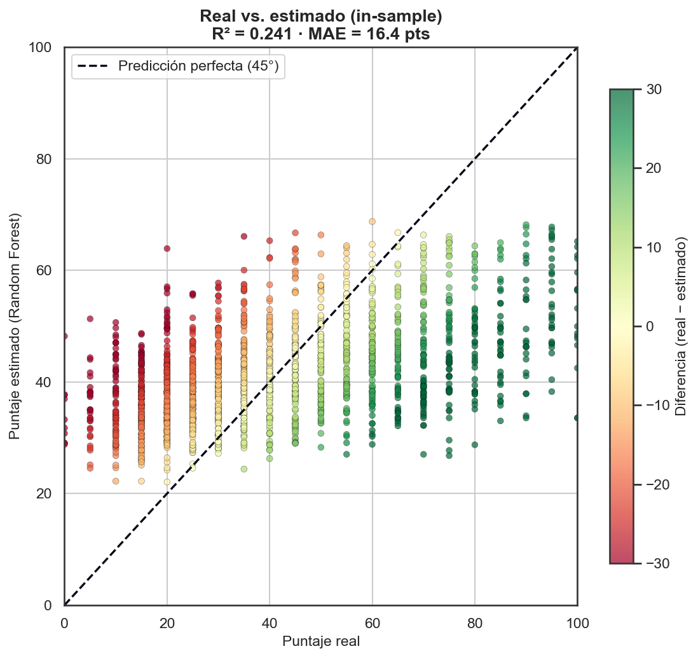
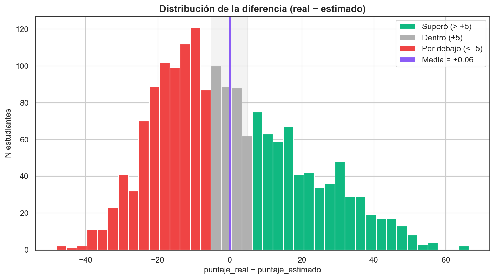
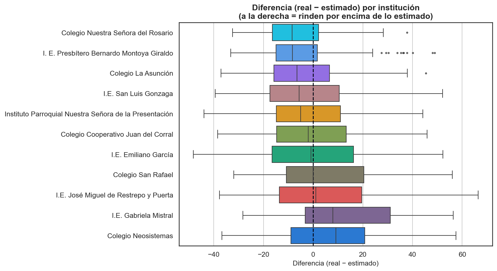
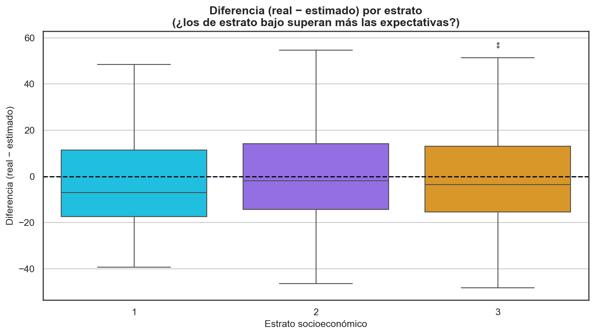
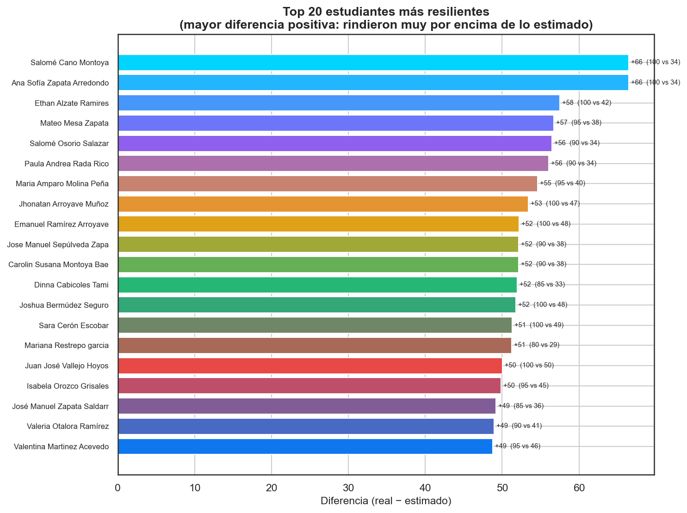

# Puntaje Estimado vs Real — Copa STEM 2026

**Fundación SapienceLab** · Fase 4 · Informe generado: 2026-07-06 08:18

---

## Resumen ejecutivo

Se generó, para cada uno de los **1,748 estudiantes** que presentaron,
un `puntaje_estimado` con el modelo Random Forest (script 03): lo que el
modelo *esperaba* que sacara dado su perfil socioeconómico y académico. La
**diferencia** (`real − estimado`) mide resiliencia cruda: **634
estudiantes (36%) superaron su expectativa** (> +5
pts), **305 (17%) quedaron dentro de lo esperado**
(±5) y **809 (46%) por debajo**. La diferencia
media es **+0.06**, señal de que el modelo está bien
calibrado (sin sesgo sistemático). El modelo NO es muy preciso a nivel
individual (R² out-of-fold = 0.084, MAE = 18.1
pts): las variables de un formulario explican solo una parte pequeña del
rendimiento. Por eso la diferencia se debe leer por tramos amplios, nunca
como un juicio exacto sobre un estudiante.

## ¿Qué es el puntaje estimado?

Es lo que el modelo Random Forest **predice** que un estudiante sacará, a
partir de su perfil (estrato, acceso a computador/internet, nivel de
programación/robótica, experiencia previa, etc.). **No es una nota real: es
una EXPECTATIVA estadística.**

> Imagina dos estudiantes con exactamente el mismo perfil (mismo estrato,
> mismo colegio, mismo grado, mismos recursos). El modelo dice: *"estudiantes
> con este perfil típicamente sacan alrededor de 45 puntos"*. Si uno de ellos
> saca 70, hay algo especial en ese estudiante —motivación, talento natural,
> un buen profesor— que el modelo no puede medir pero que nosotros sí podemos
> **detectar** mirando la diferencia.

## ¿Cómo se calcula?

El modelo es un **Random Forest** ("bosque aleatorio"), que funciona así:

- Aprende **reglas** a partir de los datos, como un árbol de decisiones
  gigante. Una regla se lee: *"si el estudiante es de Girardota **y** tiene
  computador **y** está en grado 11 → estimar 52 puntos"*.
- El modelo tiene **cientos de estos árboles** (aquí, 300), cada uno con
  reglas ligeramente distintas, y **promedia** sus respuestas. Promediar
  muchos árboles imperfectos da una predicción más estable que un solo árbol.
- Todas las reglas se aprendieron de los **1,748 estudiantes** que ya
  presentaron el examen.

## ¿Qué tan preciso es?

Hay que distinguir dos números:

| Métrica | Sobre los datos de entrenamiento (in-sample) | Con validación cruzada (honesta) |
| --- | --- | --- |
| R² | 0.241 | **0.084** |
| MAE | 16.4 pts | **18.1 pts** |
| RMSE | 20.1 pts | **22.1 pts** |

La columna izquierda mide el modelo sobre estudiantes que **ya vio** al
entrenarse: siempre se ve mejor de lo que es (como un examen con las
respuestas a la vista). La columna derecha lo mide sobre estudiantes que
**no vio** (validación cruzada); ese es el número honesto.

- **R² = 0.084** significa que el perfil socioeconómico explica
  alrededor del **8%** de por qué unos sacan más que
  otros. El 92% restante depende de cosas que el
  formulario no captura.
- **MAE = 18.1 puntos** significa que, en promedio, *el modelo
  se equivoca por unos 18 puntos*. Si el modelo dice 45, el
  estudiante realista puede sacar entre **23 y
  67** (aprox. ± un RMSE).
- **¿Por qué no es más preciso?** Porque las variables socioeconómicas solo
  explican una parte pequeña del rendimiento. La motivación, la preparación,
  la calidad del profesor, el talento natural, cómo durmió esa noche — nada
  de eso está en el formulario, pero pesa muchísimo en la nota.

## La diferencia: ¿superaste las expectativas?

`diferencia = puntaje_real − puntaje_estimado`

- **Positiva** → el estudiante rindió **mejor** de lo que su contexto sugería.
- **Negativa** → rindió **por debajo** de su potencial estimado.
- **Cerca de 0** → dentro de lo esperado.

En la cohorte: **634 superaron** (> +5), **305 dentro**
(±5) y **809 por debajo** (< -5). La diferencia
media es **+0.06** — cercana a 0, como se espera de un modelo
bien calibrado (no infla ni subestima de forma sistemática).

## Hallazgos por grupo

**Por institución** (mediana de la diferencia): el colegio donde los
estudiantes rinden más **por encima** de lo estimado es *Colegio Neosistemas*
(+9.2); el que más **por debajo** es *Colegio Nuestra Señora del Rosario*
(-8.5). Diferencias sistemáticas por colegio pueden
reflejar calidad docente, ambiente o preparación específica.

**Por estrato** (mediana de la diferencia): estrato 1: -7.0; estrato 2: -1.9; estrato 3: -3.5. Si los estratos
más bajos muestran diferencias positivas, es evidencia de **resiliencia
académica**: rinden por encima de lo que su contexto material predeciría.

## Los 20 más resilientes

Estudiantes con la mayor diferencia positiva: sacaron muchísimo más de lo
que su perfil sugería. Son candidatos a **talento oculto** (ver script 06).

| Estudiante | Institución | Estimado | Real | Diferencia |
| --- | --- | --- | --- | --- |
| Salomé Cano Montoya | I.E. José Miguel de Restrepo y Puerta | 33.55 | 100.0 | 66.45 |
| Ana Sofía Zapata Arredondo | I.E. José Miguel de Restrepo y Puerta | 33.55 | 100.0 | 66.45 |
| Ethan Alzate Ramires | Colegio Neosistemas | 42.49 | 100.0 | 57.51 |
| Mateo Mesa Zapata | I.E. José Miguel de Restrepo y Puerta | 38.27 | 95.0 | 56.73 |
| Salomé Osorio Salazar | I.E. Gabriela Mistral | 33.55 | 90.0 | 56.45 |
| Paula Andrea Rada Rico | Colegio San Rafael | 33.94 | 90.0 | 56.06 |
| Maria Amparo Molina Peña | I.E. José Miguel de Restrepo y Puerta | 40.41 | 95.0 | 54.59 |
| Jhonatan Arroyave Muñoz | I.E. Gabriela Mistral | 46.58 | 100.0 | 53.42 |
| Emanuel Ramírez Arroyave | I.E. Emiliano García | 47.8 | 100.0 | 52.2 |
| Jose Manuel Sepúlveda Zapata | I.E. San Luis Gonzaga | 37.89 | 90.0 | 52.11 |
| Carolin Susana Montoya Baena | I.E. San Luis Gonzaga | 37.89 | 90.0 | 52.11 |
| Dinna Cabicoles Tami | I.E. José Miguel de Restrepo y Puerta | 33.02 | 85.0 | 51.98 |
| Joshua Bermúdez Seguro | Colegio San Rafael | 48.23 | 100.0 | 51.77 |
| Sara Cerón Escobar | I.E. José Miguel de Restrepo y Puerta | 48.72 | 100.0 | 51.28 |
| Mariana Restrepo garcia | I.E. San Luis Gonzaga | 28.74 | 80.0 | 51.26 |
| Juan José Vallejo Hoyos | I.E. Emiliano García | 49.97 | 100.0 | 50.03 |
| Isabela Orozco Grisales | I.E. San Luis Gonzaga | 45.17 | 95.0 | 49.83 |
| José Manuel Zapata Saldarriaga | I.E. José Miguel de Restrepo y Puerta | 35.81 | 85.0 | 49.19 |
| Valeria Otalora Ramírez | I. E. Presbítero Bernardo Montoya Giraldo | 41.08 | 90.0 | 48.92 |
| Valentina Martinez Acevedo | I.E. José Miguel de Restrepo y Puerta | 46.23 | 95.0 | 48.77 |

## ¿Para qué sirve este análisis?

- **Para la Fundación:** identificar a quién apoyar. Un estudiante con
  diferencia muy negativa puede estar desmotivado o necesitar ayuda concreta.
- **Para los colegios:** si *todos* los estudiantes de un colegio superan las
  expectativas, ese colegio tiene algo especial (buenos profesores, buen
  ambiente) que vale la pena estudiar y replicar.
- **Para los estudiantes:** abre una conversación, no un veredicto —
  *"sacaste 35 pero esperábamos 45: ¿qué pasó?, ¿cómo te ayudamos?"*.

## Limitaciones

- El modelo tiene **R² bajo** (0.08): las predicciones
  individuales son imprecisas (± ~22 pts). Úsese por
  grupos, no como etiqueta individual.
- La diferencia **no es un juicio de valor**: un estudiante "por debajo" pudo
  tener un mal día, estar enfermo o nervioso.
- **Faltan variables** decisivas: motivación, horas de estudio, calidad
  docente, promedio académico previo (ver el plan de mejora del script 08).

## Glosario

- **R² (coeficiente de determinación):** *definición* — fracción de la
  varianza del puntaje que el modelo explica (0 = nada, 1 = todo).
  *Analogía* — qué porción del "misterio" de por qué unos sacan más resuelve
  el modelo. *Ejemplo Copa STEM* — R² = 0.08 → explica el
  ~8% del misterio; el resto es lo que no medimos.
- **MAE (error absoluto medio):** *definición* — promedio de |real − estimado|.
  *Analogía* — cuántos puntos, en promedio, "le erra" el modelo. *Ejemplo* —
  MAE = 18.1 → típicamente se equivoca por ~18
  puntos.
- **Random Forest (bosque aleatorio):** *definición* — modelo que promedia
  cientos de árboles de decisión entrenados sobre muestras distintas de los
  datos. *Analogía* — en vez de preguntarle a un solo experto, se pregunta a
  300 y se promedia; el consenso es más robusto. *Ejemplo* — aquí 300 árboles
  entrenados con 1,748 estudiantes.
- **Resiliencia académica:** *definición* — rendir por encima de lo que las
  condiciones socioeconómicas predicen. *Analogía* — "remar contra la
  corriente y aun así avanzar". *Ejemplo* — un estudiante de estrato 1 con
  estimado 40 que saca 75: diferencia +35.

---
_Generado por `notebooks/09b_informe_puntaje_estimado.py` — Copa STEM 2026._
