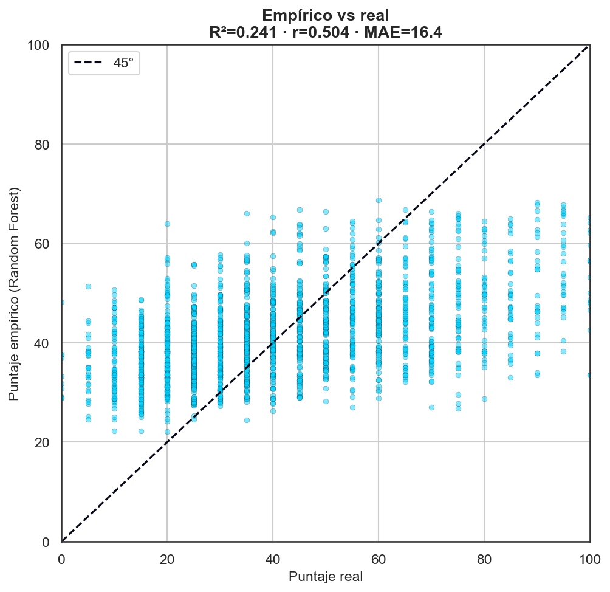
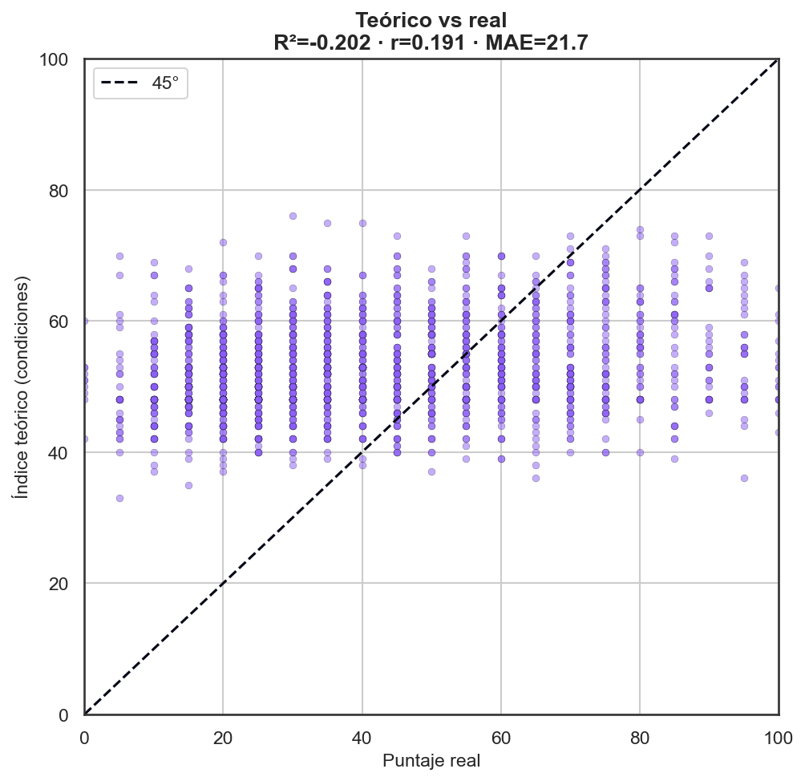
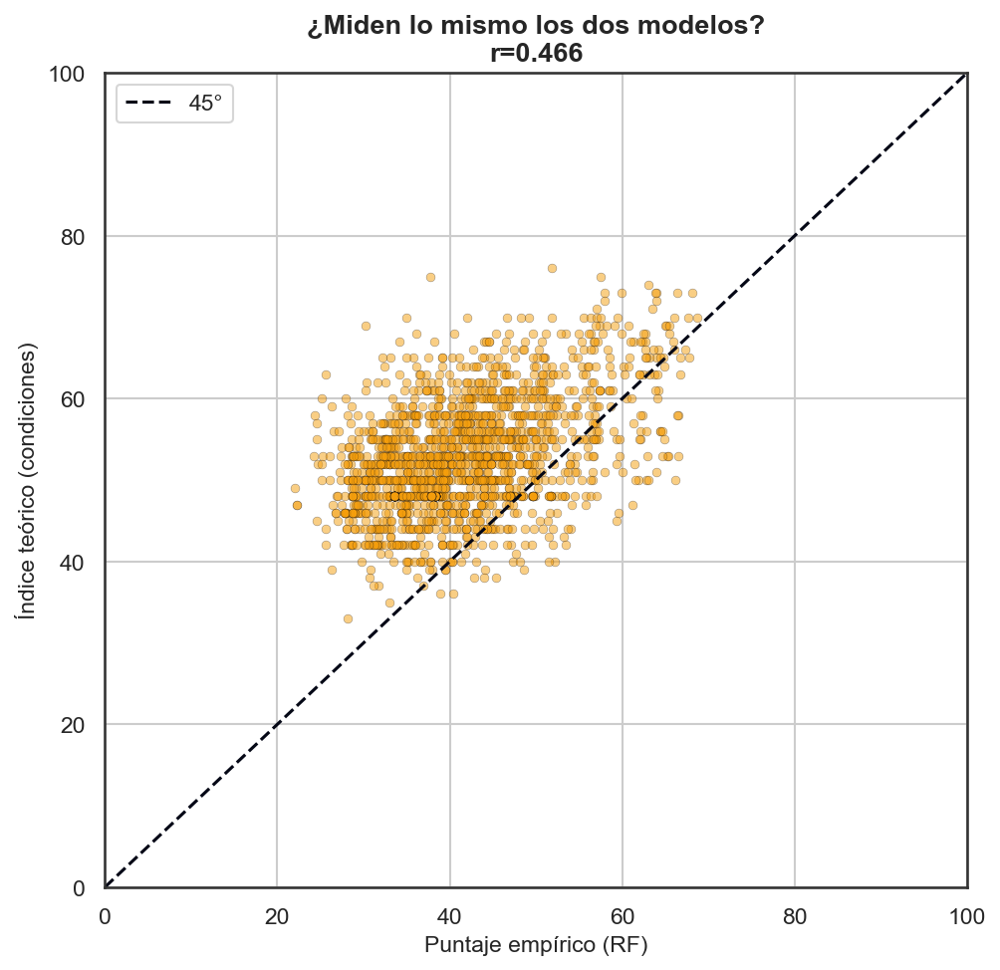
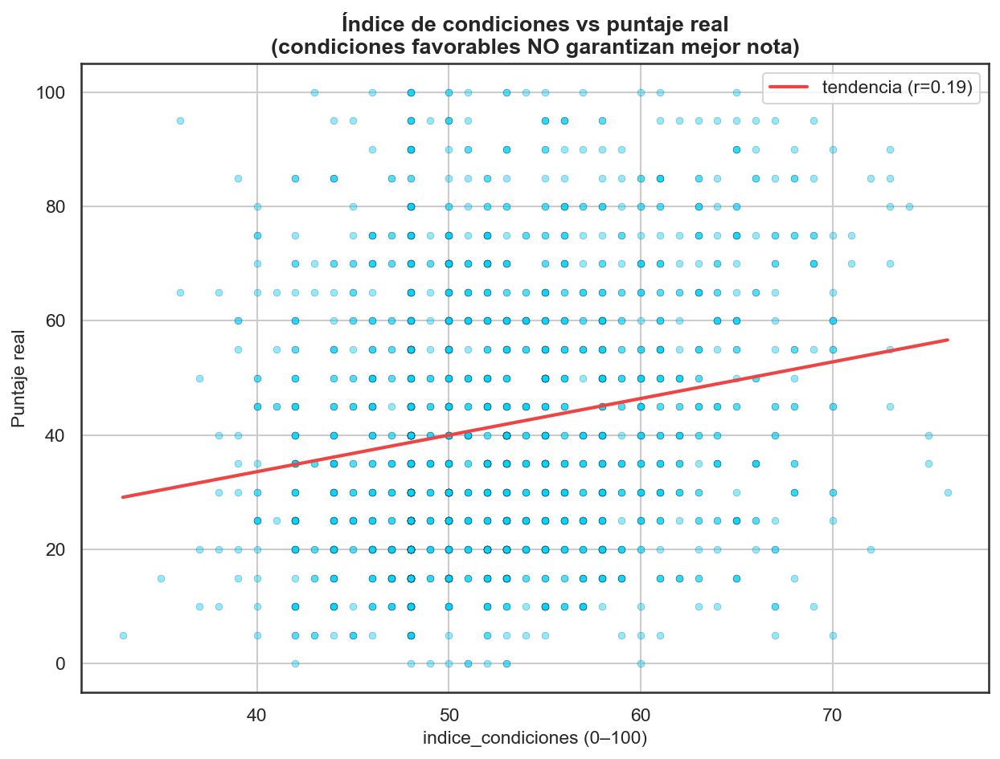
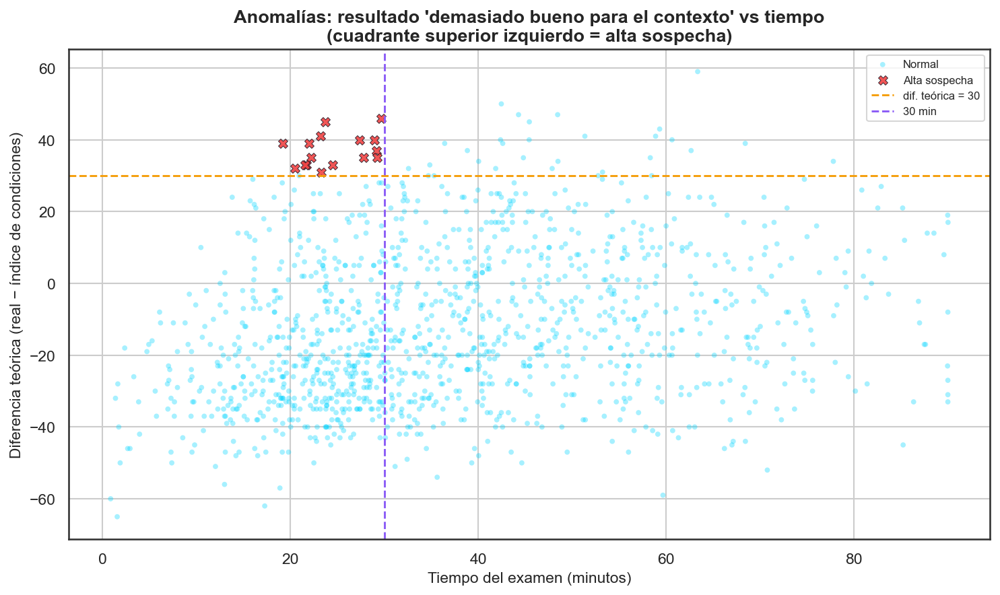
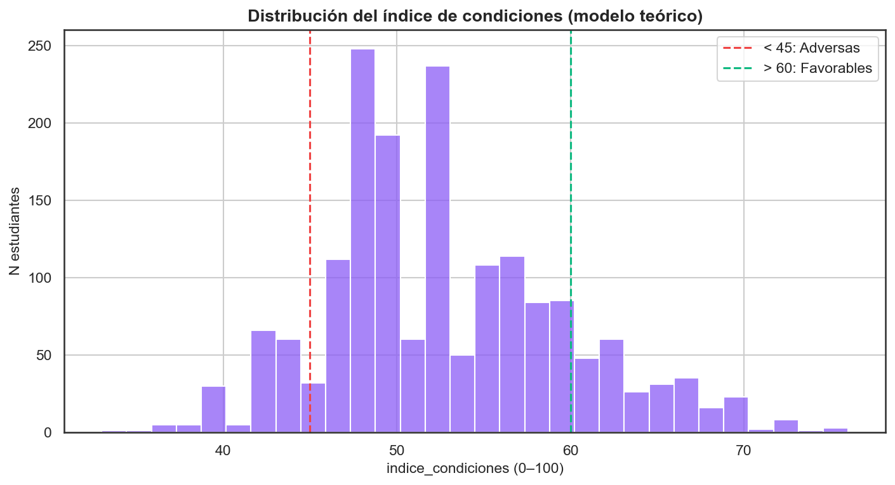
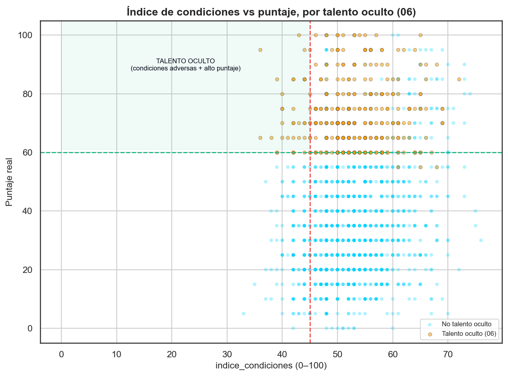

# Modelo Teórico vs Empírico — Copa STEM 2026

**Fundación SapienceLab** · Fase 4 · Informe generado: 2026-07-06 08:18

---

## Resumen ejecutivo

Se construyó un modelo **teórico** (`indice_condiciones`, 0–100) cuyos pesos
provienen SOLO de la literatura educativa (OECD PISA, UNESCO, meta-análisis
de SES), sin usar ningún resultado de Copa STEM. Se comparó con el modelo
**empírico** (Random Forest, script 03) y con el puntaje **real** de los
**1,748 estudiantes** que presentaron:

- **Empírico vs real (evaluación DENTRO DE MUESTRA):** R² = 0.241, MAE = 16.4,
  r = 0.504.
- **Teórico vs real:** R² = -0.202, MAE = 21.7,
  r = 0.191 (el índice mide *condiciones*, no la nota: su R²
  directo no es comparable en escala; la correlación es la lectura justa).
- **Correlación teórico–empírico:** r = 0.466: ambos modelos
  apuntan en la misma dirección, evidencia de que los datos reflejan en buena
  medida los patrones esperados por la literatura.

> **Etiqueta de las cifras del empírico.** El `R² = 0.241 / MAE = 16.4 / r = 0.504` es una
> evaluación **dentro de muestra** sobre las **1,748 filas** de
> `models/deploy/puntaje_estimado.csv` —el bosque puntuando a estudiantes que en su mayoría
> usó para entrenarse—, **no una estimación de generalización**: la métrica honesta de v1 es
> el R² out-of-fold = 0.084 (MAE 18.1, informes 08, 09b y 20).

El índice permitió detectar **16 casos de alta sospecha**
(resultado "demasiado bueno para el contexto" **y** examen en menos de 30
min), de los cuales **0** son **nuevos** (no los había
marcado la telemetría del script 05). Además, el índice sirve independiente de
la nota: **32 estudiantes** con condiciones adversas
(<45) sacaron ≥ 60 → talento oculto claro.

## Marco conceptual: ¿por qué dos modelos?

El modelo **empírico** (Random Forest) aprendió de los datos reales. Si en
los datos hay trampa, el modelo aprendió patrones de trampa. Es como un juez
que aprendió de casos anteriores: si algunos casos fueron fraudulentos, el
juez puede arrastrar esos sesgos.

El modelo **teórico** no usa ningún dato de Copa STEM. Se basa en lo que la
investigación educativa dice sobre qué factores afectan el rendimiento. Es
como un juez que solo sigue la ley escrita, sin importar los casos anteriores.

Comparar los dos nos dice:
- **Si coinciden** → los datos de Copa STEM reflejan los patrones esperados.
- **Si difieren** → algo en los datos es anómalo (trampa, sesgo o factores
  locales únicos que la literatura global no captura).

## ¿Qué es un modelo teórico en ciencia de datos?

- **Modelo data-driven (empírico):** aprende los pesos de los datos. Ejemplo:
  el Random Forest descubre solo que "tener computador suma X puntos" mirando
  a los estudiantes. Potente si los datos son buenos; frágil si están sucios.
- **Modelo knowledge-driven (teórico):** los pesos los fija un experto a
  partir de la literatura. Ejemplo: "según OECD PISA, el acceso a computador
  se asocia con mejor rendimiento → le asigno +3".
- **Ventajas del teórico:** no se contamina con datos malos, es transparente
  y auditable (cada peso tiene una fuente).
- **Desventajas:** los pesos son "opiniones educadas" de la literatura, no
  evidencia local; pueden no ajustar la magnitud real en Copacabana/Girardota.
- **¿Cuándo usar cada uno?** Si confías en tus datos → empírico. Si sospechas
  contaminación (trampa, muestra incompleta) → teórico como contraste.

## Construcción del modelo teórico

`indice_condiciones = 50 + Σ ajustes`, recortado a **[5, 95]**. Cada ajuste
y su sustento:

| Factor | Ajuste | Fuente / razón |
| --- | --- | --- |
| Computador en casa | Sí +3 / No −3 | OECD PISA: el acceso tecnológico se asocia con rendimiento. |
| Internet en casa | Sí +2 / No −2 | UNESCO: la conectividad da acceso a recursos de estudio. |
| Estrato (1–3) | 1: −3 · 2: 0 · 3: +2 | Recursos del hogar, alimentación, ambiente de estudio (Sirin 2005). |
| Vive con ambos padres | Sí +1 / Otro −1 | Meta-análisis: estabilidad familiar, efecto pequeño pero consistente. |
| Nivel programación | Ninguno −3 · Básico 0 · Intermedio +4 · Avanzado +8 | Preparación previa directa para el examen. |
| Nivel robótica | Ninguno −1 · Básico 0 · Intermedio +2 · Avanzado +4 | Preparación previa complementaria. |
| Participó en olimpiadas | Sí +5 / No 0 | Experiencia y familiaridad con el formato. |
| Interés prog/robótica | bajo(1–2) −2 · medio(3) 0 · alto(4–5) +3 | Motivación intrínseca. |
| Nº herramientas conocidas | 0 −2 · 1–2 0 · 3+ +3 | Capital tecnológico acumulado. |

**Lo que asumimos:** que estos factores empujan el rendimiento en la dirección
y magnitud aproximada que dice la literatura. **Lo que NO asumimos:** nada
sobre municipio, grado, género, tipo de institución ni colegio — están
excluidos por estar potencialmente contaminados (trampa, muestra incompleta).
El estrato viene **corregido en origen**: en Copacabana/Girardota/Bello el
máximo real es 3, así que los antiguos 4/5/6 (autorreporte) ya fueron
reclasificados a 3 en el dataset.

*Ejemplo real:* un estudiante de estrato 1, sin computador, con internet, que
vive solo con la madre, sin programación ni robótica, sin olimpiadas, interés
medio y sin herramientas obtiene
`50 − 3(estrato) − 3(sin PC) + 2(internet) − 1(familia) − 3(prog) − 1(rob) +
0 + 0 − 2(herr) = 39` → condiciones **adversas**.

## Comparación: ¿cuál predice mejor?

| Modelo | R² vs real | MAE | r (Pearson) |
| --- | --- | --- | --- |
| Empírico (Random Forest) — **dentro de muestra** | 0.241 | 16.4 | 0.504 |
| Teórico (indice_condiciones) | -0.202 | 21.7 | 0.191 |

**Interpretación.** El empírico gana en R² y MAE porque está *calibrado a la
escala del puntaje* (aprendió los números exactos de estos datos). El R² del
teórico es bajo/negativo porque **no está en la escala de la nota**: es un
índice de condiciones centrado en 50, no un pronóstico del puntaje. Por eso la
métrica justa para el teórico es la **correlación** (r = 0.191):
mide si *ordena* bien a los estudiantes, no si acierta el número.

**¿Se complementan?** Sí. La correlación entre ambos modelos es
**r = 0.466**: miden algo parecido, pero el teórico es
inmune a la trampa presente en los datos. Sirve de **red de seguridad**: donde
empírico y teórico discrepan mucho, hay que mirar de cerca.

## Anomalías encontradas

`diferencia_teorica = puntaje_real − indice_condiciones`. Un valor **>
30** significa "resultado demasiado bueno para el contexto":
posible trampa **o** talento excepcional. Cruzándolo con el tiempo de examen:

- Resultados "demasiado buenos para el contexto" (dif > 30):
  **88**.
- De esos, con examen en **< 30 min** → **alta sospecha: 16**.
- **Coinciden** con los señalados por la telemetría del script 05:
  **16**.
- **NUEVOS** sospechosos que la telemetría NO detectó (p. ej. exámenes
  escritos sin telemetría): **0**.

Los "nuevos" son valiosos: el modelo teórico ve señales que la telemetría no
puede (no depende de cambios de pestaña ni de copiar/pegar), así que actúa como
una segunda capa de auditoría independiente.

## El índice de condiciones como herramienta

El índice NO predice la nota: mide las **condiciones** del estudiante. Es útil
*independiente* del rendimiento. Distribución en la cohorte:
**Favorables (>60): 253** ·
**Promedio (45–60): 1,322** ·
**Adversas (<45): 173**.

- *"María tiene índice de condiciones 28 (adversas). Sacó 75. Es talento
  oculto."* → prioridad de apoyo y visibilidad.
- *"Carlos tiene índice 65 (favorables). Sacó 90 en 12 minutos. Sospechoso."*
  → revisar antes de premiar.

**Cruce con talento oculto (script 06):** de los **32**
estudiantes con condiciones adversas que sacaron ≥ 60,
el 100%
también fueron marcados como talento oculto por el modelo del script 06 → los
dos enfoques (reglas de condiciones y clasificador de talento) se refuerzan.

## Recomendaciones

- **Para producción:** usar el **empírico** para estimar el puntaje (mejor
  calibrado), pero acompañarlo SIEMPRE del **teórico** como auditoría y del
  `indice_condiciones` para contexto socioeconómico.
- **Modelo combinado:** un promedio 50/50 (tras llevar ambos a la misma escala)
  puede ser más robusto que cualquiera solo, porque el teórico amortigua la
  contaminación por trampa del empírico. Recomendado evaluarlo formalmente.
- **Datos a recoger** para mejorar ambos: promedio académico previo, horas de
  estudio, motivación y fecha/hora de inscripción (ver plan del script 08).
- **Priorización:** revisar los 0 nuevos sospechosos y
  dar visibilidad a los talentos ocultos con condiciones adversas.

## Limitaciones

- Los pesos teóricos son **aproximaciones de la literatura general**, no
  calibrados con datos locales; su magnitud puede no ser exacta aquí.
- La literatura es **global**: Copacabana/Girardota pueden tener dinámicas
  propias que estos pesos no capturan.
- El **R² del teórico es bajo** (no está en la escala del puntaje); eso **no**
  lo hace peor: cumple otra función (medir condiciones, auditar), y su valor se
  juzga por correlación y por su independencia de la trampa.
- Un `diferencia_teorica` alta puede ser **talento excepcional**, no trampa: la
  señal es un disparador de revisión, nunca una condena automática.

## Glosario extendido

- **Modelo data-driven vs knowledge-driven:** *definición* — el primero aprende
  los pesos de los datos; el segundo los fija desde teoría. *Analogía* —
  aprender a cocinar probando (data-driven) vs seguir una receta de un libro
  (knowledge-driven). *Ejemplo Copa STEM* — el RF (empírico) vs el
  indice_condiciones (teórico).
- **Sesgo de confirmación en datos:** *definición* — un modelo que aprende de
  datos sesgados reproduce y amplifica ese sesgo. *Analogía* — un loro que
  repite lo que oye, incluidos los errores. *Ejemplo* — si los tramposos
  quedaron en los datos, el empírico "aprende" que su perfil rinde más.
- **Validación cruzada:** *definición* — evaluar el modelo en datos que no vio,
  repartiendo la muestra en pliegues. *Analogía* — estudiar con unas preguntas
  y examinarte con otras distintas. *Ejemplo* — el R² honesto del empírico
  (~0.08) sale de validación cruzada 5-fold (script 08).
- **Índice de condiciones:** *definición* — puntaje 0–100 del contexto
  socioeconómico y la preparación previa, NO de la habilidad. *Analogía* — el
  "hándicap" en golf: describe las condiciones de partida, no quién es mejor.
  *Ejemplo* — índice 28 = condiciones adversas.
- **Anomalía estadística:** *definición* — observación que se aparta mucho de
  lo esperado por el modelo. *Analogía* — un termómetro que marca 45 °C en la
  nevera: o está roto o pasa algo raro. *Ejemplo* — sacar 90 con índice 35 en
  12 minutos.

## Referencias bibliográficas

- OECD (2015). *Students, Computers and Learning: Making the Connection* (PISA).
- UNESCO (2020). *Global Education Monitoring Report — technology in education*.
- Sirin, S. R. (2005). *Socioeconomic Status and Academic Achievement: A
  Meta-Analytic Review of Research*. Review of Educational Research.
- Hattie, J. (2009). *Visible Learning* (síntesis de meta-análisis de factores
  que afectan el rendimiento).

_Auto-verificación del predictor exportado: máx|Δ| = 0 (predictor .py vs cálculo del notebook)._

---
_Generado por `notebooks/10_modelo_teorico_vs_empirico.py` — Copa STEM 2026._
