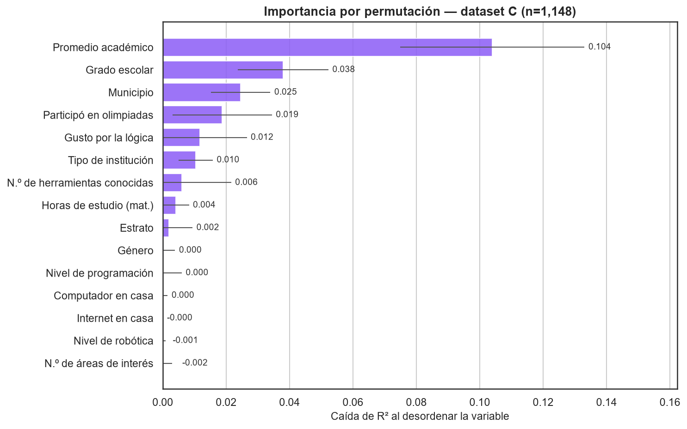
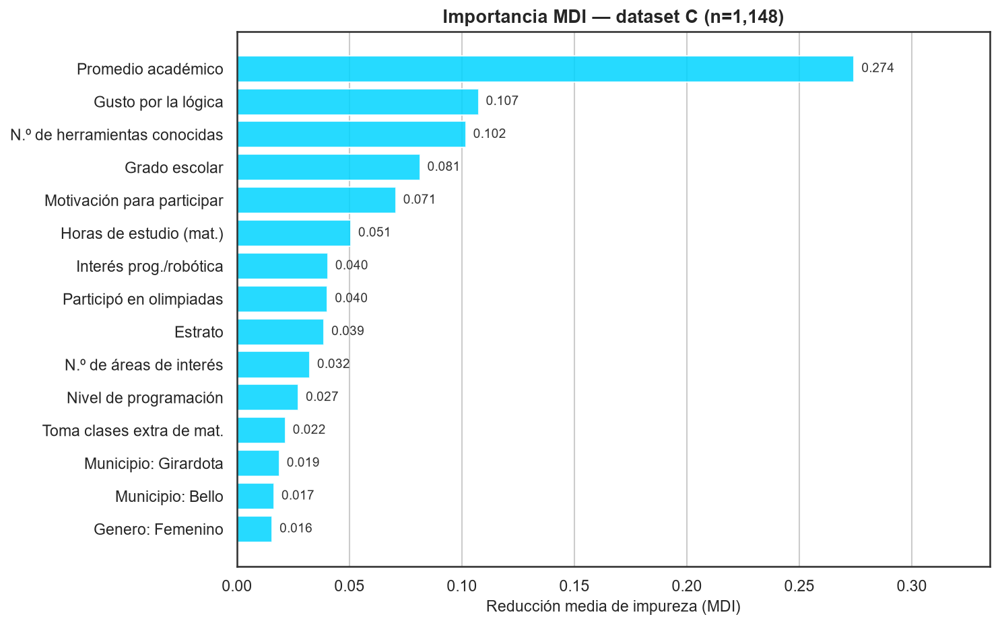
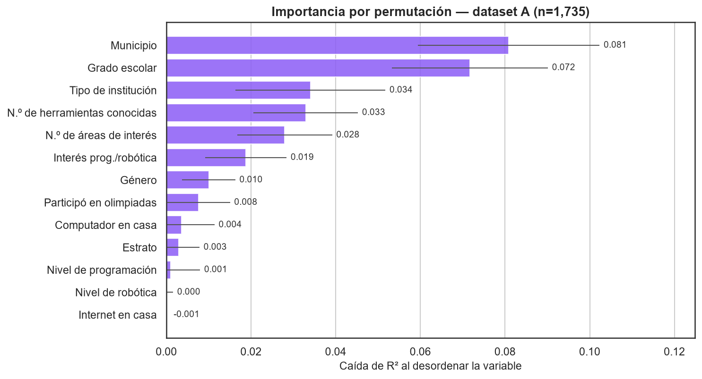
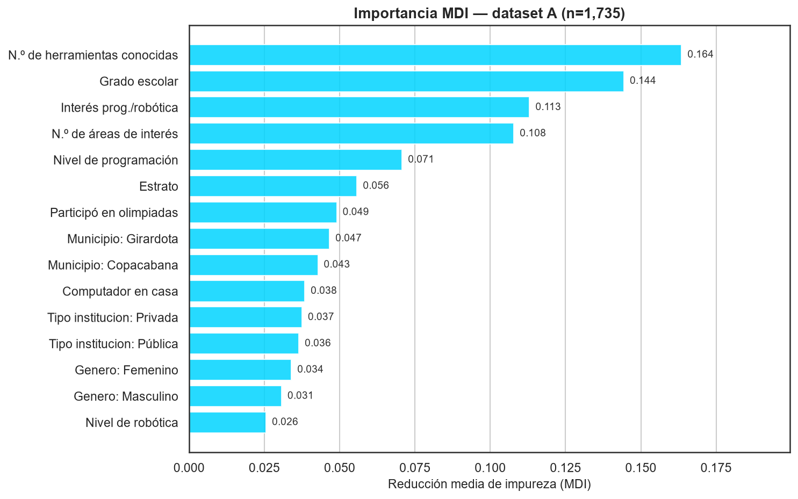

# Análisis de Explicabilidad — Copa STEM 2026

**Fundación SapienceLab** · Fase 5 · Informe generado: 2026-08-29

---

## Resumen ejecutivo

El script 12 estableció **que** las 5 variables de perfil académico mejoran la
predicción (R² +0.098 → +0.180) y que 5 variables de conducta explican más que 18
de origen socioeconómico. Este informe responde la pregunta siguiente: **cuáles**
variables pesan, y cuánto.

- **`promedio_academico` domina el ranking.** Desordenarla cuesta **0.104 de
  R²** — **2.7 veces más** que la segunda variable. Ninguna variable de origen
  socioeconómico se le acerca.
- **El acceso a tecnología es irrelevante para predecir la nota.** `computador_en_casa`
  e `internet_en_casa` tienen importancia **estadísticamente nula** (ΔR² ≈ 0.000).
- **El estrato tampoco predice.** ΔR² = 0.002 ± 0.007: indistinguible de cero.
- **Pero el contexto no desaparece.** `municipio` y `grado_escolar` se mantienen
  en los puestos 2 y 3, así que el territorio y el momento escolar siguen
  pesando; lo que cambia es que **dejan de encabezar la lista**.

En la cohorte A —sin perfil académico— el ranking lo encabezaba `municipio`
(ΔR² = 0.081). Al añadir el perfil, `promedio_academico` lo desplaza con una
importancia superior a la de todas las variables de contexto juntas.

## Metodología

### Dos medidas de importancia, y por qué las dos

- **MDI** (*Mean Decrease in Impurity*) — cuánto usó el bosque cada variable
  para partir sus nodos. Viene gratis con el modelo, pero está **sesgada hacia
  variables con muchos valores distintos**: `promedio_academico` tiene 41 valores
  y ofrece más puntos de corte que una binaria Sí/No, lo que infla su importancia
  aunque no prediga mejor.
- **Permutación** — cuánto **empeora el R² en datos no vistos** al desordenar
  aleatoriamente una variable. Mide impacto predictivo real y no sufre ese sesgo.

Cuando ambas coinciden, la conclusión es sólida. Cuando discrepan, casi siempre
es el sesgo de cardinalidad de la MDI, y **manda la permutación**. Este informe
reporta las dos y basa sus conclusiones en la segunda.

### Configuración

| Aspecto | Decisión |
| --- | --- |
| Modelo | `RandomForestRegressor(300, max_depth=10, min_samples_leaf=8)` |
| MDI | Entrenado sobre el **100 %** de las filas |
| Permutación | Entrenado sobre 80 %, evaluado sobre el 20 % restante |
| Repeticiones | 30 permutaciones por variable |
| Métrica | Caída de R² |
| Semilla | `random_state=42` |

> **Por qué el modelo de MDI usa todas las filas.** Su único propósito es leer el
> ranking, nunca estimar desempeño. Entrenar sin partición aprovecha toda la
> información disponible para el ranking. **Las métricas válidas de desempeño son
> las del script 12**, obtenidas con validación cruzada; ningún número de este
> informe debe leerse como una estimación de qué tan bien predice el modelo.

La permutación se calcula sobre las columnas **crudas**, antes del one-hot, de
modo que `municipio` aparece una sola vez y no fragmentada en `municipio_Bello`,
`municipio_Copacabana` y `municipio_Girardota`. Es la lectura que interesa para
decidir qué preguntar en el formulario.

## Dataset C — con perfil académico (n = 1,148)

| # | Variable | ΔR² | ± | Bloque |
| --- | --- | --- | --- | --- |
| 1 | **Promedio académico** | **+0.1040** | 0.0291 | Perfil académico |
| 2 | Grado escolar | +0.0380 | 0.0143 | Contexto |
| 3 | Municipio | +0.0246 | 0.0094 | Contexto |
| 4 | Participó en olimpiadas | +0.0187 | 0.0157 | Experiencia previa |
| 5 | **Gusto por la lógica** | +0.0117 | 0.0148 | Perfil académico |
| 6 | Tipo de institución | +0.0104 | 0.0054 | Contexto |
| 7 | N.º de herramientas conocidas | +0.0060 | 0.0156 | Experiencia previa |
| 8 | **Horas de estudio (mat.)** | +0.0041 | 0.0042 | Perfil académico |
| 9 | Estrato | +0.0020 | 0.0074 | Socioeconómico |
| 10 | Género | +0.0004 | 0.0035 | Demográfico |
| 11 | Nivel de programación | +0.0001 | 0.0059 | Experiencia previa |
| 12 | Computador en casa | +0.0001 | 0.0015 | Socioeconómico |

**Lectura.** El primer puesto no está en disputa: `promedio_academico` pesa más
que las variables 2, 3 y 4 sumadas. Es además el resultado esperable —el mejor
predictor del rendimiento futuro es el rendimiento pasado— pero hasta ahora el
proyecto no tenía cómo medirlo, porque la variable no existía en el formulario.

**Sobre las barras de error.** Varias variables tienen desviación mayor que su
propia importancia: `Gusto por la lógica` (0.0117 ± 0.0148), `Participó en
olimpiadas` (0.0187 ± 0.0157), `N.º de herramientas` (0.0060 ± 0.0156). En esos
casos **la importancia no es distinguible de cero** con esta muestra. Solo los
puestos 1, 2, 3 y 6 tienen una señal claramente mayor que su incertidumbre.

**Las variables de acceso a tecnología no predicen la nota.** `Computador en
casa` (+0.0001 ± 0.0015) e `Internet en casa` (−0.0000) son indistinguibles de
cero. Seis variables obtuvieron importancia negativa, lo que significa que el
modelo predice *mejor* sin ellas — la marca típica de una variable sin señal.

## Dataset A — cohorte baseline (n = 1,735)

| # | Variable | ΔR² | ± |
| --- | --- | --- | --- |
| 1 | Municipio | +0.0809 | 0.0214 |
| 2 | Grado escolar | +0.0717 | 0.0184 |
| 3 | Tipo de institución | +0.0340 | 0.0177 |
| 4 | N.º de herramientas conocidas | +0.0329 | 0.0123 |
| 5 | N.º de áreas de interés | +0.0280 | 0.0112 |
| 6 | Interés prog./robótica | +0.0188 | 0.0096 |
| 7 | Género | +0.0100 | 0.0063 |
| 8 | Participó en olimpiadas | +0.0076 | 0.0074 |
| 9 | Computador en casa | +0.0036 | 0.0078 |
| 10 | Estrato | +0.0029 | 0.0049 |

**Lectura.** Sin perfil académico, el modelo se apoya en **dónde estudia** el
estudiante y **en qué grado va**. Es un modelo de contexto: describe la posición
del estudiante en el sistema, no lo que hace dentro de él.

Nótese que incluso aquí el **estrato queda último** (+0.0029 ± 0.0049) y el
acceso a computador es casi nulo. La señal territorial no viene del estrato
individual sino del municipio y del tipo de institución, que capturan
diferencias agregadas entre sistemas educativos locales.

## Comparación A vs C

**Se mantienen en ambos top 10 (7):** Grado escolar · Municipio · Participó en
olimpiadas · Tipo de institución · N.º de herramientas conocidas · Estrato ·
Género.

**Entran en C (3):** Promedio académico · Gusto por la lógica · Horas de estudio
— las tres del bloque nuevo.

**Salen del top 10 (3):** N.º de áreas de interés · Interés prog./robótica ·
Computador en casa.

El cambio decisivo no es que entren tres variables, sino **el desplome de la
importancia relativa del contexto**:

| Variable | ΔR² en A | ΔR² en C | Cambio |
| --- | --- | --- | --- |
| Municipio | +0.0809 | +0.0246 | −70 % |
| Grado escolar | +0.0717 | +0.0380 | −47 % |
| Tipo de institución | +0.0340 | +0.0104 | −69 % |
| N.º de herramientas | +0.0329 | +0.0060 | −82 % |

**Cómo interpretar esto.** El municipio no dejó de importar en la realidad: lo
que ocurre es que **parte de lo que el municipio explicaba era, en realidad,
rendimiento académico previo**. Cuando el modelo no puede ver el promedio del
estudiante, usa el municipio como sustituto imperfecto —los municipios difieren
en desempeño escolar promedio—. Al darle la variable directa, deja de necesitar
el sustituto.

Esto es exactamente lo que el hallazgo 3 del informe 12 mostraba a nivel
agregado, visto ahora variable por variable.

## Qué significa para los estudiantes de Copa STEM

**1. El origen socioeconómico no determina el resultado.** Estrato, computador e
internet en casa tienen importancia estadísticamente nula. Un estudiante de
estrato 1 sin computador no está, según este modelo, en desventaja predecible en
la prueba. Es un resultado con peso para el discurso del programa.

**2. Lo que más pesa es modificable.** La variable dominante es el promedio
académico, y las otras dos del bloque que entran al top 10 —gusto por la lógica y
horas de estudio— describen conducta, no origen. A diferencia del estrato o el
municipio, son cosas sobre las que una intervención pedagógica puede actuar.

**3. El municipio sigue siendo un buen criterio de focalización.** Aunque su
importancia cae al añadir el promedio, sigue en el puesto 3. Para decidir **dónde**
concentrar esfuerzos, la señal territorial es real.

**4. Preguntar el promedio académico es la intervención de mejor rendimiento.**
Una sola pregunta en el formulario aporta más señal predictiva que todo el bloque
socioeconómico junto. Si hubiera que quedarse con una sola de las cinco nuevas,
sería esta.

**5. Cautela con el uso individual.** El modelo completo explica el 18 % de la
varianza. Que `promedio_academico` sea la variable más importante **dentro** de
ese 18 % no la convierte en un pronóstico confiable para un estudiante concreto.
Sirve para entender el fenómeno y diseñar programas, no para clasificar personas.

> **Advertencia causal.** La importancia por permutación mide asociación
> predictiva, no causalidad. Que el promedio académico prediga el puntaje no
> demuestra que subir el promedio suba el puntaje: lo más probable es que ambos
> reflejen una capacidad y un hábito de estudio subyacentes. Ninguna de estas
> cifras justifica por sí sola una intervención específica.

## Recomendaciones

1. **Hacer obligatorio `promedio_academico`** en el formulario. Es la variable
   más influyente del modelo y la de menor costo de recolección.
2. **Considerar retirar del formulario** las variables sin señal: `nivel_robotica`,
   `internet_en_casa` y `nivel_programacion` tienen importancia nula o negativa en
   ambos datasets. Cada pregunta que se elimina reduce la fricción de inscripción.
   *Salvedad:* si se usan para reportes de equidad o caracterización, deben
   conservarse — su valor no es predictivo pero sí descriptivo.
3. **No usar el estrato como criterio de focalización individual.** No predice el
   desempeño. Para focalizar, el municipio y el tipo de institución tienen más
   señal.
4. **Repetir el análisis cuando C supere las 2,000 filas.** Con la muestra actual
   solo cuatro variables tienen importancia claramente distinguible de cero; con
   más datos se podrá resolver el orden de los puestos 4 a 8.
5. **Investigar la brecha territorial** que queda tras controlar por promedio
   académico. Que `municipio` conserve ΔR² = 0.025 con el promedio ya en el modelo
   sugiere diferencias entre sistemas educativos locales que valdría la pena
   caracterizar.

## Limitaciones

- **Importancia ≠ causalidad.** Todo el análisis es predictivo.
- **Muestra pequeña para el detalle.** Solo los puestos 1, 2, 3 y 6 de C superan
  claramente su propia incertidumbre. El orden de los demás no es estable.
- **`promedio_academico` es autorreportado** y no está verificado contra
  registros escolares. Podría contener sesgo de deseabilidad social, aunque su
  fuerza predictiva sugiere que la mayoría reporta con razonable honestidad.
- **A y C son poblaciones distintas.** Parte de la diferencia entre los dos
  rankings puede deberse a que C es más reciente e incluye Bello, no solo a las
  variables nuevas. El contraste limpio del efecto de las variables es C vs C′
  (informe 12); esta comparación es descriptiva.
- **Un solo modelo.** Los rankings son los que ve un Random Forest. Otro
  algoritmo podría ordenar distinto, sobre todo en los puestos con incertidumbre
  alta.
- **La MDI está sesgada** hacia variables de alta cardinalidad; se reporta solo
  como contraste de la permutación.

## Glosario

- **Importancia por permutación:** *definición* — caída del desempeño al
  desordenar al azar una variable en datos no vistos. *Analogía* — quitar un
  ingrediente de una receta y ver cuánto empeora el plato. *Ejemplo* — desordenar
  `promedio_academico` cuesta 0.104 de R².
- **MDI:** *definición* — cuánto contribuyó cada variable a reducir la impureza
  en los árboles. *Analogía* — contar cuántas veces se consultó cada capítulo de
  un manual. *Ejemplo* — se consulta mucho un capítulo largo aunque no sea el más
  útil: de ahí el sesgo de cardinalidad.
- **Importancia negativa:** *definición* — el modelo predice mejor con la variable
  desordenada que en su estado original. *Analogía* — un instrumento descalibrado
  que confunde más de lo que ayuda. *Ejemplo* — `internet_en_casa` en C.
- **Variable sustituta (proxy):** *definición* — variable que el modelo usa como
  reemplazo imperfecto de otra que no observa. *Analogía* — juzgar la temperatura
  por la ropa de la gente en la calle. *Ejemplo* — `municipio` sustituyendo al
  rendimiento académico previo en el dataset A.

## Referencias bibliográficas

- Breiman, L. (2001). *Random Forests*. Machine Learning, 45(1), 5–32.
- Strobl, C., Boulesteix, A.-L., Zeileis, A. & Hothorn, T. (2007). *Bias in random
  forest variable importance measures: illustrations, sources and a solution*.
  BMC Bioinformatics. Fuente del sesgo de cardinalidad de la MDI y razón por la
  que aquí manda la permutación.
- Molnar, C. (2022). *Interpretable Machine Learning* (2.ª ed.). Capítulo de
  importancia por permutación.
- Hattie, J. (2009). *Visible Learning*. El rendimiento previo como predictor
  dominante del rendimiento futuro.

---
_Generado a partir de `notebooks/13_analisis_explicabilidad.py` — Copa STEM 2026._
